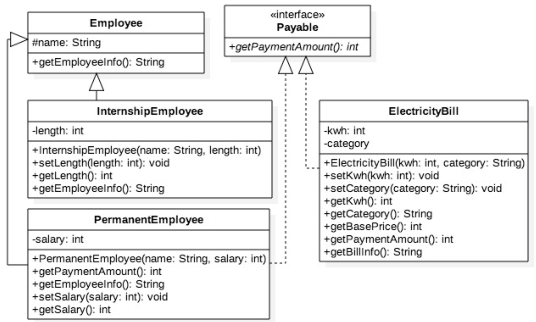
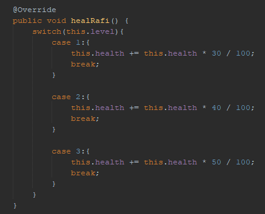
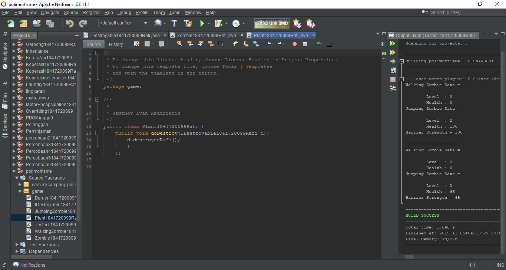
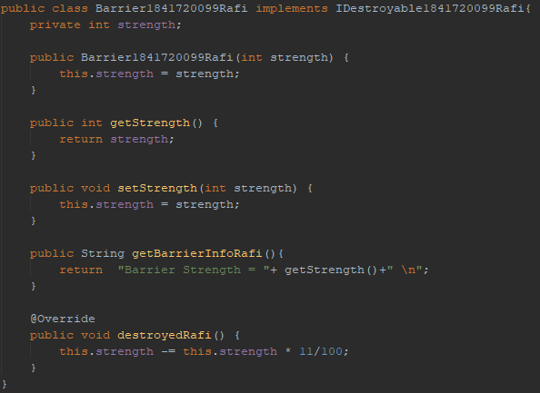

# Laporan Praktikum #10 - POLIMORFISME

## Kompetensi
Setelah melakukan percobaan pada jobsheet ini, diharapkan mahasiswa
mampu:
1. Memahami konsep dan bentuk dasar polimorfisme
2. Memahami konsep virtual method invication
3. Menerapkan polimorfisme pada pembuatan heterogeneous collection
4. Menerapkan polimorfisme pada parameter/argument method
e. Menerapkan object casting untuk meng-ubah bentuk objek

## Ringkasan Materi

#### Polimorfisme

Polimorfisme merupakan kemampuan suatu objek untuk memiliki banyak bentuk. Penggunaan polimorfisme yang paling umum dalam OOP terjadi ketika ada referensi super class yang digunakan untuk merujuk ke objek dari
sub class.

#### Virtual method Invocation

Virtual method invocation terjadi ketika ada pemanggilan overriding method
dari suatu objek polimorfisme. Disebut virtual karena antara method yang
dikenali oleh compiler dan method yang dijalankan oleh JVM berbeda.

#### Heterogeneous Collection
Dengan adanya konsep polimorfisme, maka variabel array bisa dibuat heterogen. Artinya di dalam array tersebut bisa berisi berbagai macam objek yang berbeda.

## Percobaan

### Percobaan 1

##### Class Diagram

##### Class Employee

link kode program Employee.java : [Employee.java](../../src/10_Polimorfisme/Employee1841720099Rafi.java)

##### Interface *Payable*

link kode program IPayable.java : [IPayable.java](../../src/10_Polimorfisme/IPayable1841720099Rafi.java)

##### Class InternshipEmployee

link kode program InternshipEmployee.java : [InternshipEmployee.java](../../src/10_Polimorfisme/InternshipEmployee1841720099Rafi.java)

##### Class PermanentEmployee

link kode program PermanentEmployee.java : [PermanentEmployee.java](../../src/10_Polimorfisme/PermanentEmployee1841720099Rafi.java)

##### Class ElectricityBill

link kode program ElectricityBill.java : [Electricity.java](../../src/10_Polimorfisme/ElectricityBill1841720099Rafi.java)

##### Main Tester 1

link kode program ElectricityBill.java : [Electricity.java](../../src/10_Polimorfisme/Tester11841720099Rafi.java)

##### Hasil

#### Pertanyaan

1. Class apa sajakah yang merupakan turunan dari class Employee?
   
        Terdapat 2 Class turunan, yaitu Class InternshipEmployee dan PermanentEmployee
    
2. Class apa sajakah yang implements ke interface Payable?

        Class PermanentEmployee dan ElectricityBill

3. Perhatikan class Tester1, baris ke-10 dan 11. Mengapa e, bisa diisi dengan objek pEmp (merupakan objek dari class PermanentEmployee) dan objek iEmp (merupakan objek dari class InternshipEmploye) ?

        Karena InternshipEmployee dan PermanentEmployee sama - sama meng- extend dari Class Employee 

4. Perhatikan class Tester1, baris ke-12 dan 13. Mengapa p, bisa diisi
dengan objek pEmp (merupakan objek dari class
PermanentEmployee) dan objek eBill (merupakan objek dari class
ElectricityBill) ?

        Karena ElectricityBill dan PermanentEmployee sama - sama mengimplentasi dari class Payable

5. Coba tambahkan sintaks:
   
    p = iEmp;

    e = eBill;

    pada baris 14 dan 15 (baris terakhir dalam method main) ! Apa yang menyebabkan error?

    karena iEmp tidak mengimplementasi Interface Payable dan eBill tidak mengextend class Employee

6. Ambil kesimpulan tentang konsep/bentuk dasar polimorfisme!

    Polimorfisme merupakan kemampuan suatu objek untuk memiliki banyak bentuk. Ketika ada suatu objek yang dideklarasikan dari super class, maka objek tersebut bisa diinstansiasi sebagai objek dari sub class.
         
### Percobaan 2

##### Main Tester 2

link kode program Main.java : [Main.java](../../src/10_Polimorfisme/Tester21841720099Rafi.java)

##### Hasil

#### Pertanyaan

1. Perhatikan class Tester2 di atas, mengapa pemanggilan e.getEmployeeInfo() pada baris 8 dan pEmp.getEmployeeInfo() pada baris 10 menghasilkan hasil sama?

        Karena objek e meng- override method yang ada pada pEmp, sehingga method yang berjalan adalah method pada Class PermanentEmployee

2. Mengapa pemanggilan method e.getEmployeeInfo() disebut sebagai pemanggilan method virtual (virtual method invication), sedangkan pEmp.getEmployeeInfo() tidak?
   
        Karena objek e berjalan pada JVM yang berbeda dengan objek pEmp

3. Jadi apakah yang dimaksud dari virtual method invocation? Mengapa disebut virtual?

        Virtual Method invocation terjadi ketika ada pemanggilan overriding method dari suatu objek polimorfisme. Disebut virtual karena antara method yang dikenali oleh compiler dan method yang dijalankan oleh JVM berbeda

### Percobaan 3

##### Main Tester 3

link kode program Main.java : [Main.java](../../src/10_Polimorfisme/Tester31841720099Rafi.java)

#### Pertanyaan

1. Perhatikan array e pada baris ke-8, mengapa ia bisa diisi dengan objek-objek dengan tipe yang berbeda, yaitu objek pEmp (objek dari PermanentEmployee) dan objek iEmp (objek dari InternshipEmployee) ?
   
        Karena pada kedua Class tersebut sama sama meng-extend Class Employee

2. Perhatikan juga baris ke-9, mengapa array p juga biisi dengan objek - objek dengan tipe yang berbeda, yaitu objek pEmp (objek dari PermanentEmployee) dan objek eBill (objek dari ElectricityBilling) ?
            
        Karena pada kedua Class tersebut sama sama mengimplementasikan Interface Payable
        

3. Perhatikan baris ke-10, mengapa terjadi error?

        Karena Objek eBill tidak meng-extend Class Employee

### Percobaan 4

##### Class Owner

link kode program Owner.java : [Owner.java](../../src/10_Polimorfisme/Owner1841720099Rafi.java)

##### Main Tester 4

##### Hasil

link kode program Main.java : [Main.java](../../src/10_Polimorfisme/Tester41841720099Rafi.java)

#### Pertanyaan

1. Perhatikan class Tester4 baris ke-7 dan baris ke-11, mengapa pemanggilan ow.pay(eBill) dan ow.pay(pEmp) bisa dilakukan, padahal jika diperhatikan method pay() yang ada di dalam class Owner memiliki argument/parameter bertipe Payable? Jika diperhatikan lebih detil eBill merupakan objek dari ElectricityBill dan pEmp merupakan objek dari PermanentEmployee?
   
        Karena pada kedua Class tersebut sama sama mengimplementasikan Interface Payable

2. Jadi apakah tujuan membuat argument bertipe Payable pada method pay() yang ada di dalam class Owner?
   
        Agar semua Class yang mengimplementasikan interface Payable dapat dijadikan parameter pada method di class Owner
        

3. Coba pada baris terakhir method main() yang ada di dalam class Tester4 ditambahkan perintah ow.pay(iEmp);

        Karena Class InternshipEmployee tidak mengimplementasikan Interface Payable 

4.  Perhatikan class Owner, diperlukan untuk apakah sintaks p instanceof ElectricityBill pada baris ke-6 ?
   
        Untuk mengecek apakah objek p merupakan hasil instansiasi dari class ElectricityBill 

5.  Perhatikan kembali class Owner baris ke-7, untuk apakah casting objek disana (ElectricityBill eb = (ElectricityBill) p) diperlukan ? Mengapa objek p yang bertipe Payable harus di-casting ke dalam objek eb yang bertipe ElectricityBill ?

        Agar dapat memanggil method yang ada pada Class ElectricityBill

### Tugas

##### Class Diagram

##### Interface *Destroyable*

link kode program IDestroyable.java : [IDestroyable.java](../../src/10_Polimorfisme/IDestroyable1841720099Rafi.java)

##### Class Zombie

link kode program Zombie.java : [Zombie.java](../../src/10_Polimorfisme/Zombie1841720099Rafi.java)

##### Class WalkingZombie

link kode program WalkingZombie.java : [WalkingZombie.java](../../src/10_Polimorfisme/WalkingZombie1841720099Rafi.java)

##### Class JumpingZombie

link kode program JumpingZombie.java : [JumpingZombie.java](../../src/10_Polimorfisme/JumpingZombie1841720099Rafi.java)

##### Class Plant

link kode program Plant.java : [PLant.java](../../src/10_Polimorfisme/Plant1841720099Rafi.java)

##### Class Barrier

link kode program Barrier.java : [Barrier.java](../../src/10_Polimorfisme/Barrier1841720099Rafi.java)

##### Main 

##### Hasil

link kode program Main.java : [Main.java](../../src/10_Polimorfisme/TesterT1841720099Rafi.java)

## Kesimpulan

Dari praktikum diatas kita diajarkan cara penerapan dari polimorfisme yang akan menghemat penulisan kode untuk meminimalisir adanya pembuatan method yang sama berulang kali

## Pernyataan Diri

Saya menyatakan isi tugas, kode program, dan laporan praktikum ini dibuat oleh saya sendiri. Saya tidak melakukan plagiasi, kecurangan, menyalin/menggandakan milik orang lain.

Jika saya melakukan plagiasi, kecurangan, atau melanggar hak kekayaan intelektual, saya siap untuk mendapat sanksi atau hukuman sesuai peraturan perundang-undangan yang berlaku.

Ttd,

***(Ivan Abdurrafie)***