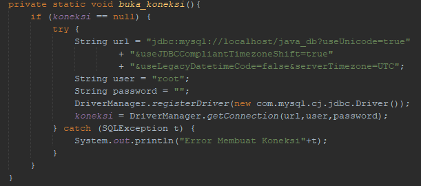
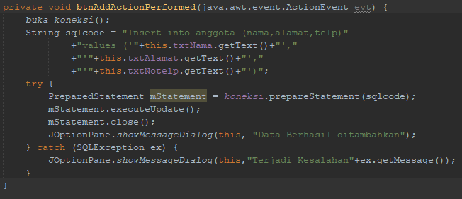

# Laporan Praktikum #12 - Collection (List, Set, Map) dan Database

## Kompetensi
Setelah menyelesaikan lembar kerja ini mahasiswa diharapkan mampu:
- Memahami cara penyimpanan objek menggunakan Collection dan Map.
- Mengetahui pengelompokan dari Collection.
- Mengetahui perbedaan dari interface Set, List dan Map.
- Mengetahui penggunaan class-class dari interface Set, List, dan Map.
- Memahami koneksi database menggunakan JDBC dan JDBC API
## Ringkasan Materi

Collection adalah suatu objek yang bisa digunakan untuk menyimpan sekumpulan objek.
Objek yang ada dalam Collection disebut elemen. Collection menyimpan elemen yang bertipe
Object, sehingga berbagai tipe object bisa disimpan dalam Collection. Class-class mengenai
Collection tergabung dalam Java Collection Framework. Class-class Collection diletakkan
dalam package java.util dan mempunyai dua interface utama yaitu Collection.

1.  Set
   
Set mengikuti model himpunan, dimana objek/anggota yang tersimpan dalam Set harus unik. Kelas konkrit yang mengimplementasikan Set harus memastikan bahwa tidak terdapat elemen duplikat yang dapat ditambahkan ke dalam set.

2. List

List digunakan untuk menyimpan sekumpulan objek berdasarkan urutan masuk (ordered)
dan menerima duplikat. Cara penyimpanannya seperti array

ArrayList digunakan untuk membuat array yang ukurannya dinamis. Berbeda dengan array
biasa yang ukurannya harus ditentukan di awal deklarasi array, dengan ArrayList, ukurannya
akan fleksibel tergantung banyaknya elemen yang dimasukkan. Tujuannya agar method dan property dari setiap object dalam ArrayList dapat diakses secara
langsung.

3. Map

HashMap adalah class implementasi dar Map, Map itu sendiri adalah interface yang
memiliki fungsi untuk memetakan nilai dengan key unik. HashMap berfungsi sebagai memory
record management

## Percobaan

### Percobaan 1 Set

##### Source code Hash Set


link kode program CobaHashSet.java : [CobaHashSet.java](../../src/12_Java_API/DemoHashSet1841720099Rafi.java)

##### Hasil


#### Pertanyaan
1. Apakah fungsi import java.util.*; pada program diatas!
   
        fungsi tersebut digunakan untuk mengimport semua library java util

2. Pada baris program keberapakah yang berfungsi untuk menciptakan object HashSet?
   
   ``` java
   Set mSetCity = new HashSet();
   ```

3. Apakah fungsi potongan program dibawah ini pada percobaan 1!
   
   

        Untuk menambahkan data pada hash set

4. Tambahkan set.add(“Malang”); kemudian jalankan program! Amati hasilnya dan jelaskan mengapa terjadi error!
        
        Data hanya akan ditampilkan 1, jadi data "Malang" yang berada di bawah tidak akan ditampilkan 

5. Jelaskan fungsi potongan program dibawah ini pada percobaan 1!
   
   

        Menampilkan seluruh data dengan menggunakan perulangan dan Iterator
   

         
### Percobaan 2 List

##### Source code ArrayList


link kode program CobaArrayList.java : [CobaArrayList.java](../../src/12_Java_API/CobaArrayList1841720099Rafi.java)

##### Hasil


#### Pertanyaan

1. Apakah fungsi potongan program dibawah ini!
   
   

       baris pertama untuk menampilkan seluruh data, untuk baris kedua dan ketiga berfungsi untuk menampilkan data sesuai index yang diinginkan 

2. Ganti potongan program pada soal no 1 menjadi sebagai berikut

   
Kemudian jalankan program tersebut!

3. Jelaskan perbedaan menampilkan data pada ArrayList menggunakan potongan program pada
soal no 1 dan no 2!

        perbedaan terlihat pada hasil output data, jika menggunakan potongan soal 1 maka hasilnya akan menampilkan data sesuai index yang dipilih, sedangkan jika menggunakan potongan soal 2 maka hasilnya akan menampilkan seluruh data pada arraylist


### Percobaan 3 Map

##### Source Code HashMap       


link kode program DemoHashMap.java : [DemoHashMap.java](../../src/12_Java_API/DemoHashMap1841720099Rafi.java)

#### Hasil


#### Pertanyaan

1. Jelaskan fungsi hMapItem.put("1","Biskuit") pada program!
   
        menambahkan data dengan key 1 dengan value biskuit

2. Jelaskan fungsi hMapItem.size() pada program!
            
        melihat jumlah data yang sudah dimasukkan pada hashmap
        
3. Jelaskan fungsi hMapItem.remove("1") pada program!
        
        menghapus data dari hashmap dengan index atau key 1

4. Jelaskan fungsi hMapItem.clear() pada program!

        menghapus semua data atau element dari hashmap

5. Tambahkan kode program yang di blok pada program yang sudah anda buat!

6. Jalankan program dan amati apa yang terjadi!
7. Apakah perbedaan program sebelumnya dan setelah ditambahkan kode program pada soal no 5 diatas? Jelaskan!
   
        setelah ditambahkan kode program diatas semua data atau element yang berada di hashmap akan ditampilkan
   

### Percobaan 4 (Implementasi ArrayList dalam GUI)

##### Design


##### Mahasiswa


link kode program Mahasiswa.java : [Mahasiswa.java](../../src/12_Java_API/Mahasiswa1841720099Rafi.java)


##### InputData


link kode program InputData.java : [InputData.java](../../src/12_Java_API/InputData1841720099Rafi.java)

##### GUI


link kode program TampilGUI.java : [TampilGUI.java](../../src/12_Java_API/TampilGui1841720099Rafi.java)

##### Hasil


### Percobaan 5

##### Design GUI Interface


##### Source Code


###### Menambahkan Dependency msyql-connector-java


###### import library java


###### method buka_koneksi



###### Konstruktor


###### Button Tambah Data



###### Pertanyaan

5. Setelah menambah code pada action button klik, coba jalankan program dan tambahkan data. Apakah program berhasil menambahkan data? Jika tidak apakah penyebabnya.
        
        Ya, program dapat menambahkan data

6. Jelaskan maksud source code untuk melakukan insert data diatas?

        yang pertama dilakukan adalah memanggil method buka_koneksi() setelah itu mendeklarasikan query untuk menambah data ke tabel anggota lalu melakukan try catch untuk menjalankan query diatas, jika query benar maka data akan terupdate dan mendapatkan pesan dialog "Data berhasil ditambahkan" dan menutup koneksi ke database jika gagal, maka akan ditampilkan dimana letak error tersebut

###### method Ambil_data


###### Pertanyaan

9. Jelaskan alur dari method ambil_data_tabel?
    
        pertama menghapus semua element yang berada di tabel lalu membuka koneksi ke database, setelah itu membuat query untuk menampilkan data dari tabel anggota yaitu "select * from anggota", query di jalankan, setelah query dijalankan data akan ditampilkan dengan menggunakan perulangan sesuai dengan tabel yang telah disediakan, menutup koneksi database, jika terjadi error atau kesalahan maka pesan dialog akan ditampilkan serta bagian yang error tersebut
    
        
10. Buat fungsi untuk merefresh sehingga data yang baru dapat ditampilkan pada tabel 2.
    


        dengan menambahkan method ambil_data kedalam Button Action Refresh

##### Hasil


link kode program Swing2.java : [Swing2.java](../../src/11_GUI/Swing21841720099Rafi.java)

## Kesimpulan

Dari praktikum diatas kita diajarkan cara penerapan dari Java API yang memudahkan programmer dalam membuat suatu program, serta penerapan dari GUI yang terkoneksi ke database agar data bisa disimpan ke dalam database agar ketika program di tutup dan dijalankan kembali, data yang telah diinputkan tidak hilang

## Pernyataan Diri

Saya menyatakan isi tugas, kode program, dan laporan praktikum ini dibuat oleh saya sendiri. Saya tidak melakukan plagiasi, kecurangan, menyalin/menggandakan milik orang lain.

Jika saya melakukan plagiasi, kecurangan, atau melanggar hak kekayaan intelektual, saya siap untuk mendapat sanksi atau hukuman sesuai peraturan perundang-undangan yang berlaku.

Ttd,

***(Ivan Abdurrafie)***