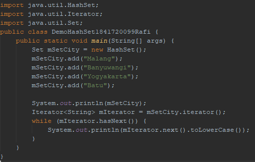

# Laporan Praktikum #12 - Collection (List, Set, Map) dan Database

## Kompetensi
Setelah menyelesaikan lembar kerja ini mahasiswa diharapkan mampu:
- Memahami cara penyimpanan objek menggunakan Collection dan Map.
- Mengetahui pengelompokan dari Collection.
- Mengetahui perbedaan dari interface Set, List dan Map.
- Mengetahui penggunaan class-class dari interface Set, List, dan Map.
- Memahami koneksi database menggunakan JDBC dan JDBC API
## Ringkasan Materi

Collection adalah suatu objek yang bisa digunakan untuk menyimpan sekumpulan objek.
Objek yang ada dalam Collection disebut elemen. Collection menyimpan elemen yang bertipe
Object, sehingga berbagai tipe object bisa disimpan dalam Collection. Class-class mengenai
Collection tergabung dalam Java Collection Framework. Class-class Collection diletakkan
dalam package java.util dan mempunyai dua interface utama yaitu Collection.

1.  Set
   
Set mengikuti model himpunan, dimana objek/anggota yang tersimpan dalam Set harus unik. Kelas konkrit yang mengimplementasikan Set harus memastikan bahwa tidak terdapat elemen duplikat yang dapat ditambahkan ke dalam set.

2. List

List digunakan untuk menyimpan sekumpulan objek berdasarkan urutan masuk (ordered)
dan menerima duplikat. Cara penyimpanannya seperti array

ArrayList digunakan untuk membuat array yang ukurannya dinamis. Berbeda dengan array
biasa yang ukurannya harus ditentukan di awal deklarasi array, dengan ArrayList, ukurannya
akan fleksibel tergantung banyaknya elemen yang dimasukkan. Tujuannya agar method dan property dari setiap object dalam ArrayList dapat diakses secara
langsung.

3. Map

HashMap adalah class implementasi dar Map, Map itu sendiri adalah interface yang
memiliki fungsi untuk memetakan nilai dengan key unik. HashMap berfungsi sebagai memory
record management

## Percobaan

### Percobaan 1 Set

##### Source code Hash Set




link kode program HelloGUI.java : [HelloGUI.java](../../src/11_GUI/HelloGui1841720099Rafi.java)

##### Hasil


         
### Percobaan 2 MyInputForm

##### JFrame MyInputForm


link kode program MyInputForm.java : [MyInputForm.java](../../src/11_GUI/MyInputForm1841720099Rafi.java)

##### Hasil


#### Pertanyaan

1.Modifikasi kode program dengan menambahkan JButton baru untuk melakukan fungsi perhitungan penambahan, sehingga ketika button di klik (event click) maka akan menampilkan hasil penambahan dari nilai A dan B

        Dengan menambahkan class baru di dalam class CreateButton dan membuat listener dari class yang telah dibuat 

``` java

    class Perkalian implements ActionListener{

            @Override
            public void actionPerformed(ActionEvent e) {
                int a = Integer.valueOf(aField.getText());
                int b = Integer.valueOf(bField.getText());
                int c = a+b;
                cLabel.setText("Hasil  : "+c);
            }
            
        }
        ActionListener listener = new AddInterestListener();
        ActionListener listener1 = new Perkalian();
        button.addActionListener(listener);
        button1.addActionListener(listener1);
    
```     

### Percobaan 3 Manajemen Layout

##### JFrame Border


link kode program Border.java : [Border.java](../../src/11_GUI/Border1841720099Rafi.java)

##### JFrame Box


link kode program Box.java : [Box.java](../../src/11_GUI/Box1841720099Rafi.java)

##### JFrame Grid


link kode program Grid.java : [Grid.java](../../src/11_GUI/Grid1841720099Rafi.java)

#### Main Layout


link kode program LayoutGUI.java : [LayoutGUI.java](../../src/11_GUI/LayoutGUI1841720099Rafi.java)

#### Hasil

1. Layout Border


2. Layout Box
   

   
3. Layout Grid


#### Pertanyaan

1. Apa perbedaan dari Grid Layout, Box Layout dan Border Layout?
   
        Perbedaan dari grid layout, box layout dan border layout terdapat di tata letak dari tiap tiap layout

2. Apakah fungsi dari masing-masing kode berikut?


            
        memanggil Jframe tiap jenis layout yang telah dibuat sebelumnya, yaitu border,box dan grid
        


### Percobaan 4

##### Design GUI Interface


##### Deklarasi Variable


##### Button Tampil


##### Button Clear


##### Hasil


link kode program Swing.java : [Swing.java](../../src/11_GUI/Swing1841720099Rafi.java)

### Percobaan 5

##### Design GUI Interface

###### Tab 1


###### Tab 2


###### Tab 3


##### Tree


##### Hasil


link kode program Swing2.java : [Swing2.java](../../src/11_GUI/Swing21841720099Rafi.java)

#### Pertanyaan

1. Apa kegunaan komponen swing JTabPane, JTtree, pada percobaan 5?
   
        Perbedaan dari grid layout, box layout dan border layout terdapat di tata letak dari tiap tiap layout

2. Modifikasi program untuk menambahkan komponen JTable pada tab Halaman 1 dan tab Halaman 2
        


### Tugas

##### JForm Kalkulator

##### Desain Kalkulator


##### Source Code Kalkulator


##### Hasil


link kode program Kalkulator.java : [Kalkulator.java](../../src/11_GUI/Kalkulator1841720099Rafi.java)


## Kesimpulan

Dari praktikum diatas kita diajarkan cara penerapan dari GUI yang memudahkan user untuk menggunakan sebuah program, GUI java terbagi menjadi 2 yaitu AWT dan Swing dengan komponen AWT yang komponennya diawali huruf J

## Pernyataan Diri

Saya menyatakan isi tugas, kode program, dan laporan praktikum ini dibuat oleh saya sendiri. Saya tidak melakukan plagiasi, kecurangan, menyalin/menggandakan milik orang lain.

Jika saya melakukan plagiasi, kecurangan, atau melanggar hak kekayaan intelektual, saya siap untuk mendapat sanksi atau hukuman sesuai peraturan perundang-undangan yang berlaku.

Ttd,

***(Ivan Abdurrafie)***