# Laporan Praktikum #14 - GUI dan Database

## Kompetensi
Setelah menempuh materi percobaan ini, mahasiswa mampu mengenal:
1. Menggunakan paradigma berorientasi objek untuk interaksi dengan database
2. Membuat backend dan frontend
3. Membuat form sebagai frontend
   
## Ringkasan Materi

Secara umum, tahapan yang akan kita lakukan adalah sebagai berikut:
1. Membuat database dan tabel-tabelnya.
2. Membuat backend yang berisi class-class yang mewakili data yang ada pada database, danclass helper untuk melakukan eksekusi query database.
   
3. Membuat frontend yang merupakan antarmuka kepada pengguna. 
   

Frontend ini bisa berbasis teks (console), GUI, web, mobile, dan sebagainya. Library yang digunakan untuk project ini antara lain:

1. JDBC, untuk melakukan interaksi ke database.
2. ArrayList, untuk menampung data hasil query ke database.
3. Swing, untuk membuat tampilan GUI

## Percobaan

### Percobaan Membuat database

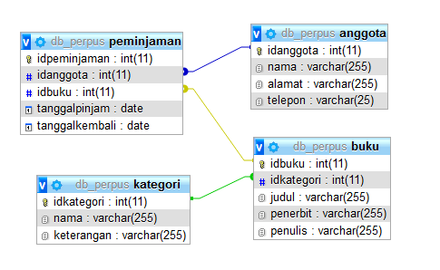
         
### Percobaan 2 Membuat Projek dan membuat 2 package yaitu Frontend dan Backend

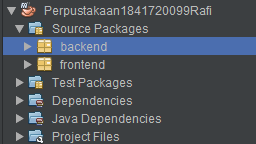

### Percobaan 3 Membuat Class DBHelper untuk mengeksekusi perintah SQL

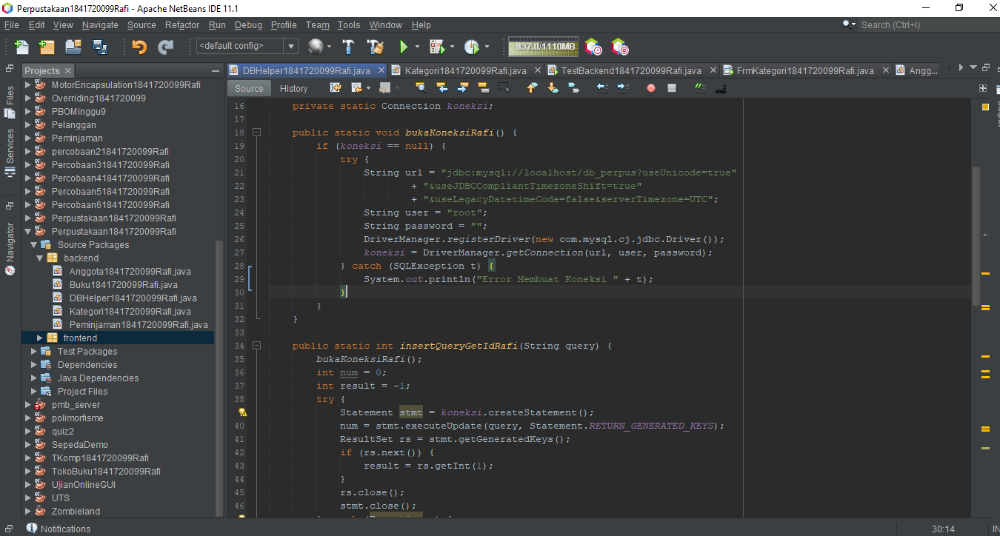

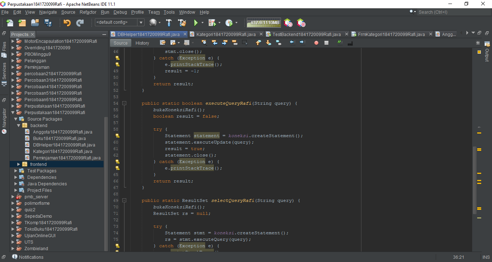

link kode program DBHelper.java : [DBHelper.java](../../src/14_GUI_dan_Database/backend/DBHelper1841720099Rafi.java)

### Percobaan 4 (Membuat Class Kategori)

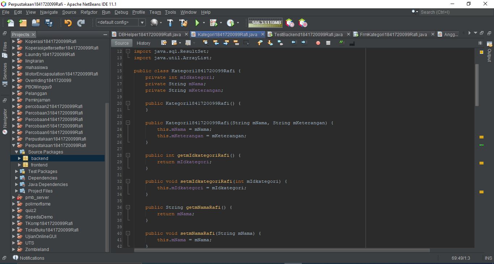

link kode program Kategori.java : [kategori.java](../../src/14_GUI_dan_Database/backend/Kategori1841720099Rafi.java)

### Percobaan 5

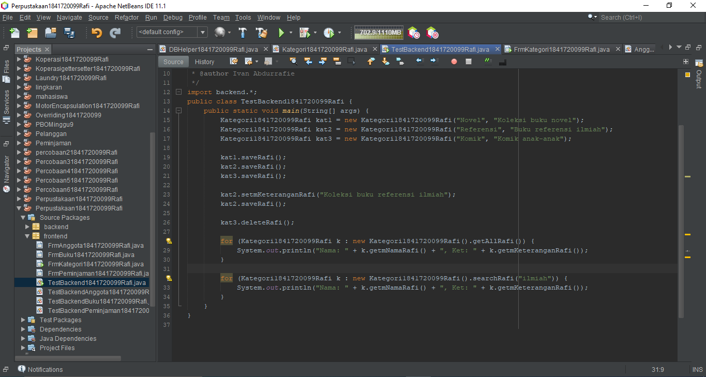

##### Hasil

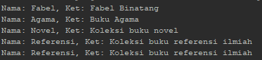

link kode program TestBackendKategori.java : [TestBackendKategori.java](../../src/14_GUI_dan_Database/frontend/TestBackend1841720099Rafi.java)

### Percobaan 6

Membuat Form Kategori 

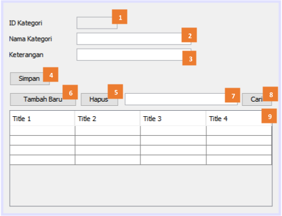

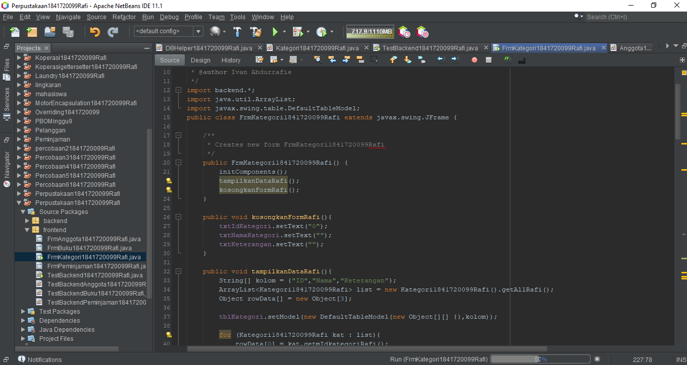

##### Hasil

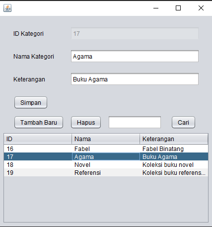

link kode program FormKategori.java : [FormKategori.java](../../src/14_GUI_dan_Database/frontend/FrmKategori1841720099Rafi.java)

link kode program FormKategori.form : [FormKategori.form](../../src/14_GUI_dan_Database/frontend/FrmKategori1841720099Rafi.form)

### Percobaan 7

Membuat Class Anggota

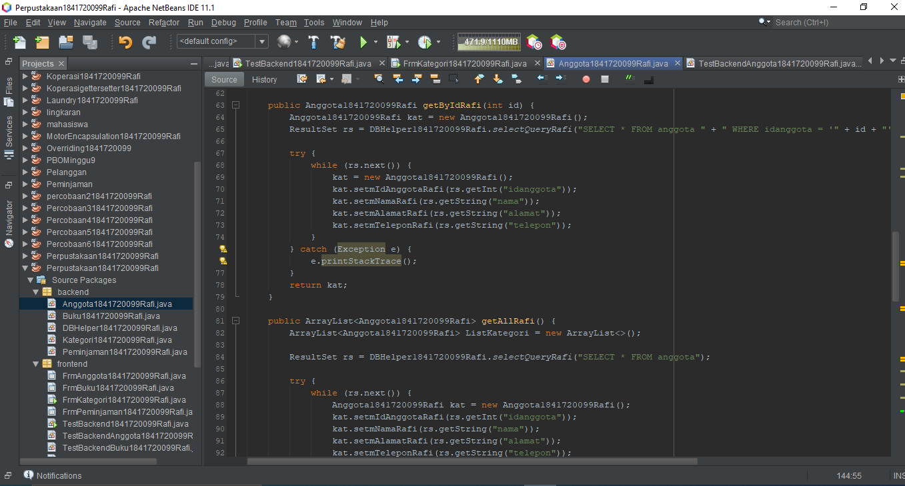

link kode program Anggota.java : [Anggota.java](../../src/14_GUI_dan_Database/backend/Anggota1841720099Rafi.java)

Membuat Class TestBackendAnggota

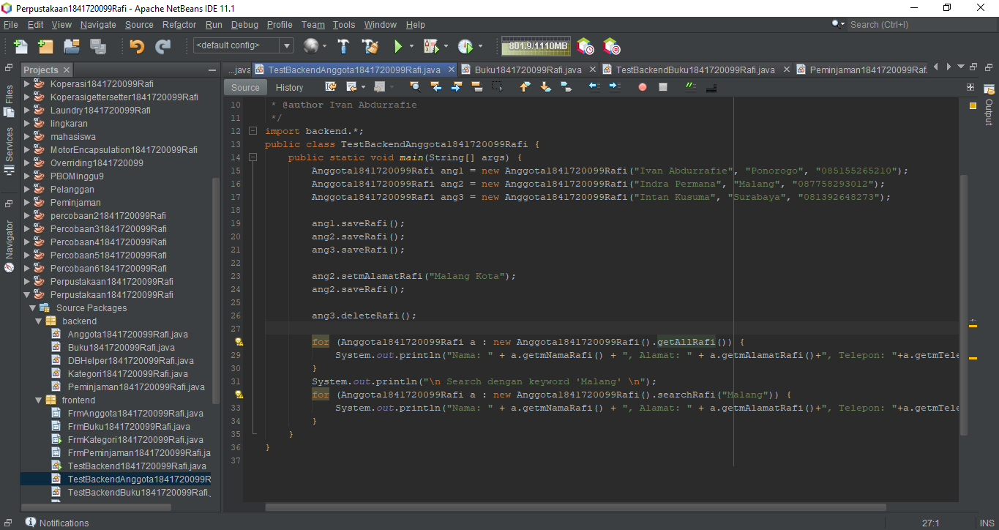

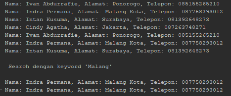

link kode program TestBackendAnggota.form : [TestBackendAnggota.form](../../src/14_GUI_dan_Database/frontend/TestBackendAnggota1841720099Rafi.java)

Membuat Class Form Anggota

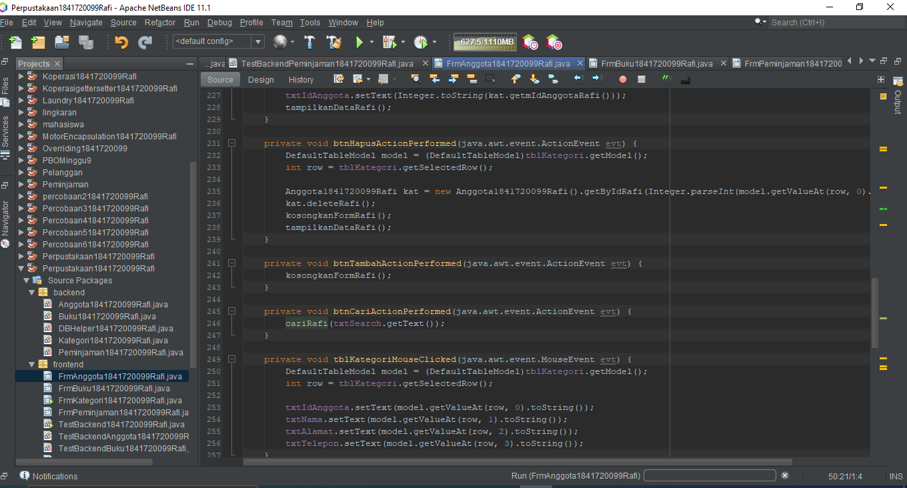

link kode program FormAnggota.form : [FormKategori.form](../../src/14_GUI_dan_Database/frontend/FrmAnggota1841720099Rafi.form)

link kode program FormAnggota.java : [FormKategori.java](../../src/14_GUI_dan_Database/frontend/FrmAnggota1841720099Rafi.java)

##### Hasil

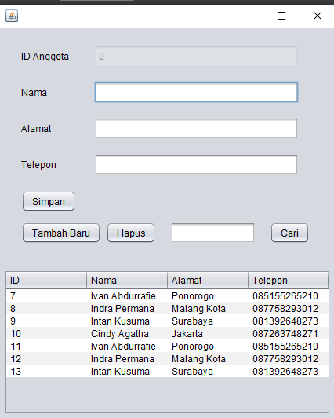

link kode program FormKategori.java : [FormKategori.java](../../src/14_GUI_dan_Database/frontend/FrmKategori1841720099Rafi.java)

link kode program FormKategori.form : [FormKategori.form](../../src/14_GUI_dan_Database/frontend/FrmKategori1841720099Rafi.form)

### Percobaan 7 Buku

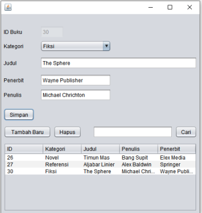

Membuat Class Buku

link kode program Buku.java : [buku.java](../../src/14_GUI_dan_Database/backend/Buku1841720099Rafi.java)

Membuat Class TestBackendBuku

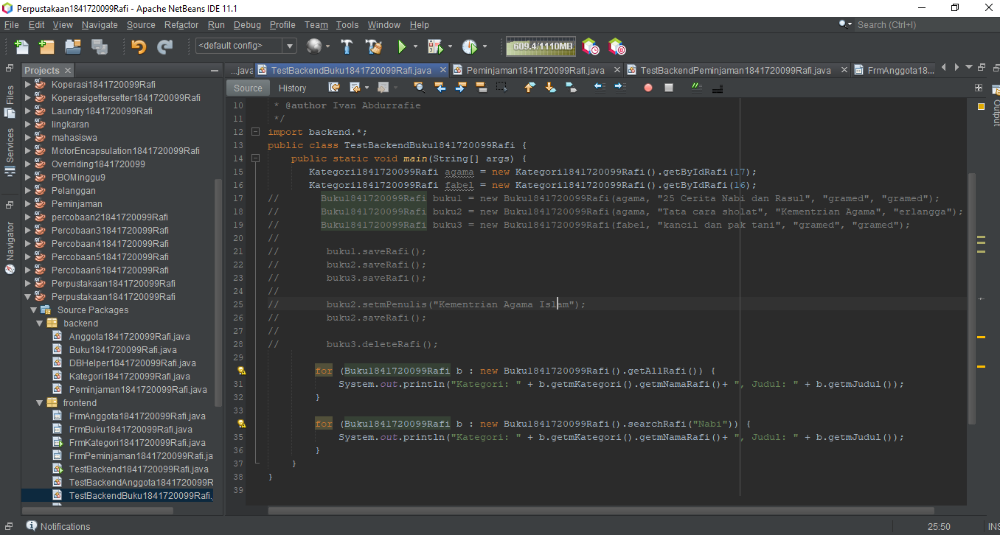

link kode program TestBackendBuku.java : [TestBackendBuku.java](../../src/14_GUI_dan_Database/frontend/TestBackendBuku1841720099Rafi.java)

Membuat Class Form Buku

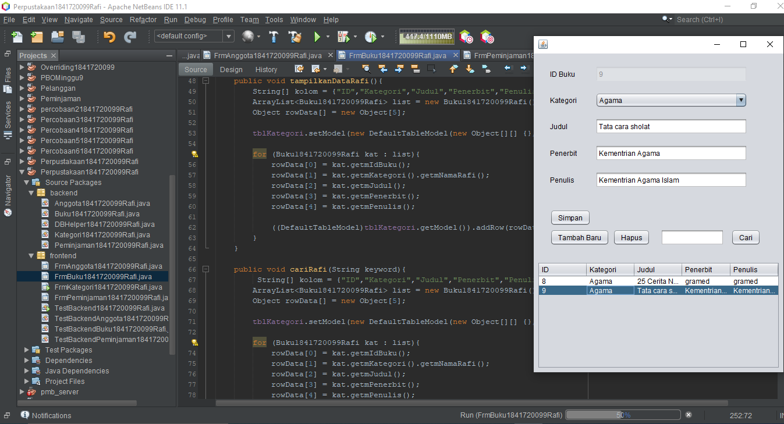

link kode program FormBuku.form : [FormBuku.form](../../src/14_GUI_dan_Database/frontend/FrmAnggota1841720099Rafi.form)

link kode program FormBuku.java : [FormBuku.java](../../src/14_GUI_dan_Database/frontend/FrmAnggota1841720099Rafi.java)

### Percobaan 8 Peminjaman

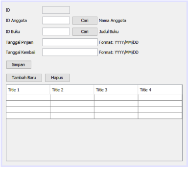

Membuat Class Buku

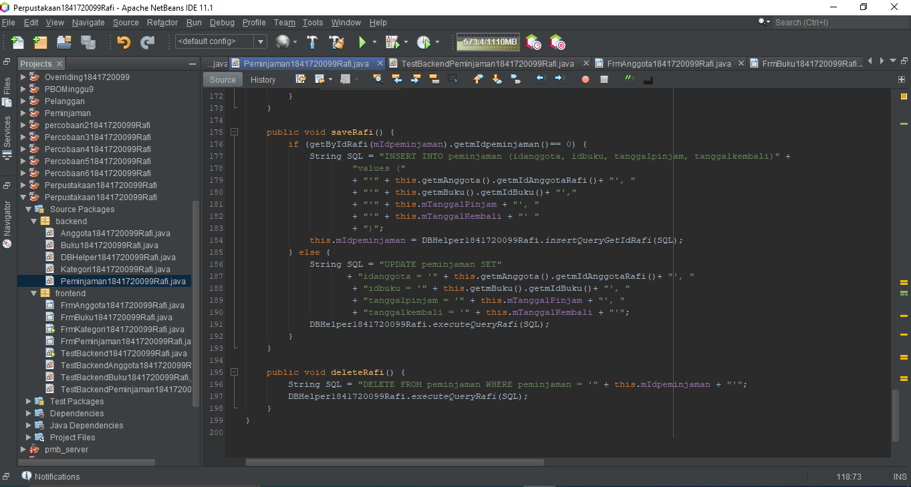

link kode program peminjaman.java : [peminjaman.java](../../src/14_GUI_dan_Database/backend/Peminjaman1841720099Rafi.java)

Membuat Class TestBackendPeminjaman

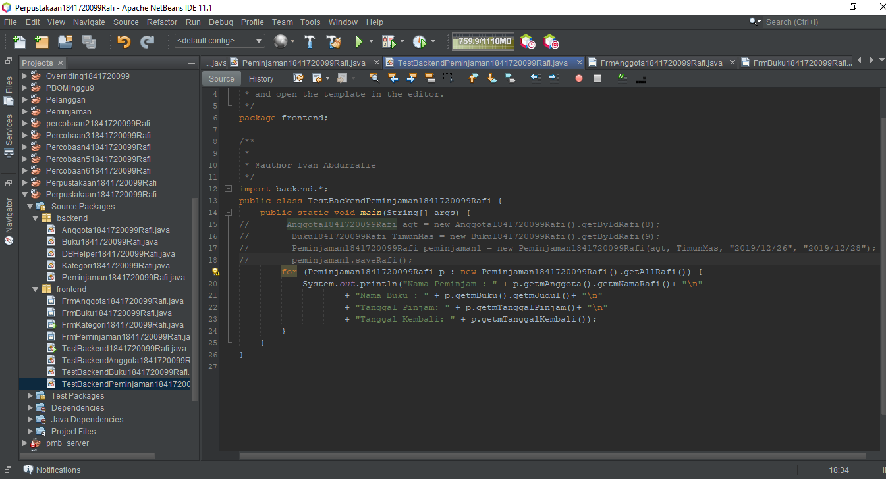

link kode program TestBackendPeminjaman.java : [TestBackendPeminjaman.java](../../src/14_GUI_dan_Database/frontend/TestBackendPeminjaman1841720099Rafi.java)

Membuat Class Form Peminjaman

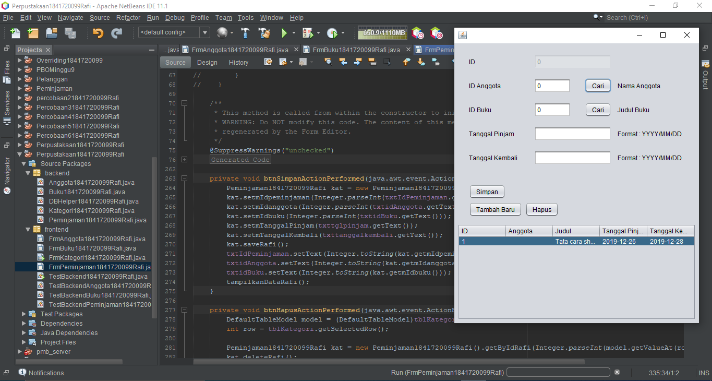

link kode program FormPeminjaman.form : [FormPeminjaman.form](../../src/14_GUI_dan_Database/frontend/FrmAnggota1841720099Rafi.form)

link kode program FormPeminjaman.java : [FormPeminjaman.java](../../src/14_GUI_dan_Database/frontend/FrmAnggota1841720099Rafi.java)

## Kesimpulan

Dari praktikum diatas kita diajarkan cara penerapan dari pemisahan backend dan frontend pada java beserta pengaplikasian gui dengan database

## Pernyataan Diri

Saya menyatakan isi tugas, kode program, dan laporan praktikum ini dibuat oleh saya sendiri. Saya tidak melakukan plagiasi, kecurangan, menyalin/menggandakan milik orang lain.

Jika saya melakukan plagiasi, kecurangan, atau melanggar hak kekayaan intelektual, saya siap untuk mendapat sanksi atau hukuman sesuai peraturan perundang-undangan yang berlaku.

Ttd,

***(Ivan Abdurrafie)***