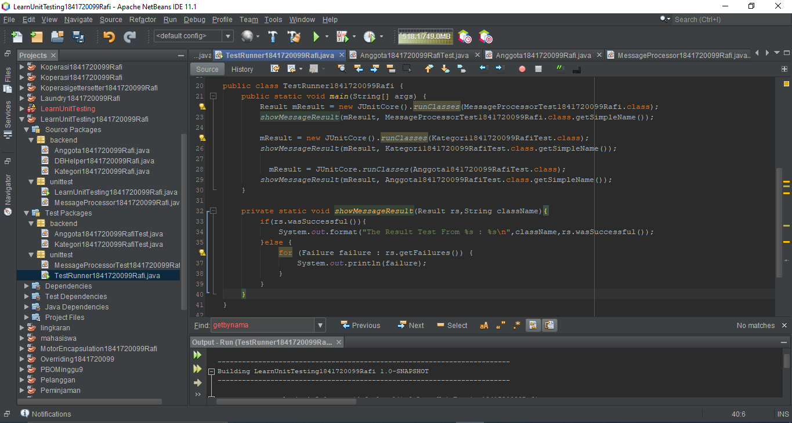
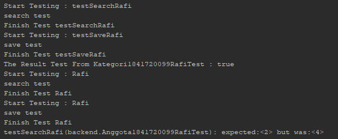

# Laporan Praktikum #15 - Unit Testing

## Kompetensi
Setelah menyelesaikan lembar kerja ini mahasiswa diharapkan mampu:

1. Memahami konsep dan fungsi unit testing
2. Menerapkan unit testing dengan JUnit pada program sederhana.
3. Menerapkan unit testing dengan JUnit pada progam yang terkoneksi database

   
## Ringkasan Materi

Unit testing adalah sebuah proses yang digunakan untuk melakukan testing terhadap setiap method-method atau komponen yang ada di dalam suatu class apakah method atau komponen tersebut sudah berjalan sesuai dengan diharapkan. Saat melakukan testing kita akan menggunakan library yang bernama JUnit.

### Percobaan 1
Contoh Unit Testing Sederhana untuk mengecheck apakah Output dari sebuah class akan sama seperti yang diharapkan atau tidak

#### hasil

#### source code 

link kode program LearnUnitTesting.java : [LearnUnitTesting.java](../../src/15_Unit_Testing/main/java/unittest/LearnUnitTesting1841720099Rafi.java)

link kode program MessageProcessor.java : 
[MessageProcessor.java](../../src/15_Unit_Testing/main/java/unittest/MessageProcessor1841720099Rafi.java)

link kode program TestRunner.java : [TestRunner.java](../../src/15_Unit_Testing/test/java/unittest/TestRunner1841720099Rafi.java)

link kode program MessageProcessorTest.java : 
[MessageProcessorTest.java](../../src/15_Unit_Testing/test/java/unittest/MessageProcessorTest1841720099Rafi.java)
         
### Percobaan 2 membuat test case dari salah satu percobaan jobsheet 14

#### Unit Testing Class Kategori 

#### hasil

#### Source Code

link kode program Kategori.java : [Kategori.java](../../src/15_Unit_Testing/main/java/backend/Kategori1841720099Rafi.java)

link kode program DBHelper.java : [DBHelper.java](../../src/15_Unit_Testing/main/java/backend/DBHelper1841720099Rafi.java)

link kode program TestBackend.java : [TestBackend.java](../../src/15_Unit_Testing/main/java/backend/TestBackend1841720099Rafi.java)

link kode program FormKategori.java : [FormKategori.java](../../src/15_Unit_Testing/main/java/backend/FrmKategori1841720099Rafi.java)

link kode program FormKategori.form : [FormKategori.form](../../src/15_Unit_Testing/main/java/backend/FrmKategori1841720099Rafi.form)

link kode program KategoriTest.java : [kategoriTest.java](../../src/15_Unit_Testing/test/java/backend/Kategori1841720099RafiTest.java)

link kode program TestRunner.java : [TestRunner.java](../../src/15_Unit_Testing/test/java/unittest/TestRunner1841720099Rafi.java)

##### Pertanyaan
Apa yang terjadi ketika class Kategori di run?

    Tidak terjadi apa-apa, karena class Kategori tidak memiliki method main.

### Tugas

Membuat Test Case untuk Percobaan kedua pada jobsheet 14

#### hasil

#### Source Code

link kode program Anggota.java : [Anggota.java](../../src/15_Unit_Testing/main/java/backend/Anggota1841720099Rafi.java)

link kode program DBHelper.java : [DBHelper.java](../../src/15_Unit_Testing/main/java/backend/DBHelper1841720099Rafi.java)

link kode program AnggotaTest.java : [AnggotaTest.java](../../src/15_Unit_Testing/test/java/backend/Anggota1841720099RafiTest.java)

link kode program TestRunner.java : [TestRunner.java](../../src/15_Unit_Testing/test/java/unittest/TestRunner1841720099Rafi.java)

## Kesimpulan

Dari praktikum diatas kita diajarkan cara penerapan dari unit testing, agar output keluaran yang dihasilkan sesuai dengan apa yang diharapkan sebelumnya

## Pernyataan Diri

Saya menyatakan isi tugas, kode program, dan laporan praktikum ini dibuat oleh saya sendiri. Saya tidak melakukan plagiasi, kecurangan, menyalin/menggandakan milik orang lain.

Jika saya melakukan plagiasi, kecurangan, atau melanggar hak kekayaan intelektual, saya siap untuk mendapat sanksi atau hukuman sesuai peraturan perundang-undangan yang berlaku.

Ttd,

***(Ivan Abdurrafie)***