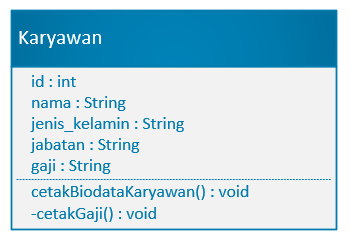
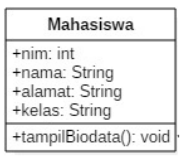
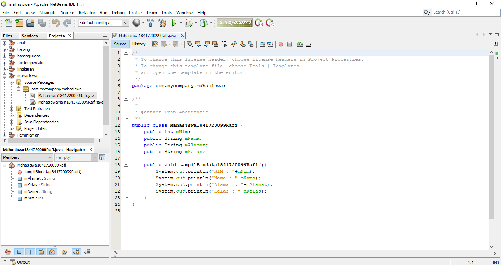
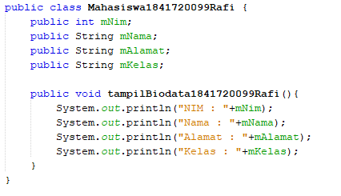
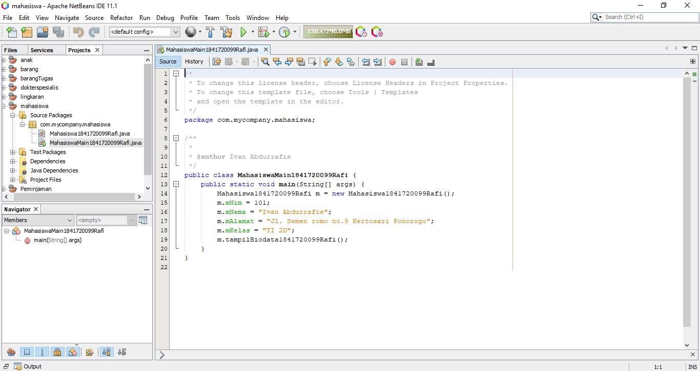
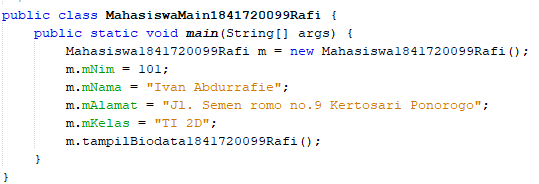
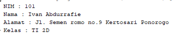

# Laporan Praktikum #1 - Pengantar Konsep PBO

## Kompetensi

1. Mahasiswa dapat memahami deskripsi dari class dan object
2. Mahasiswa memahami implementasi dari class
3. Mahasiswa dapat memahami implementasi dari attribute
4. Mahasiswa dapat memahami implementasi dari method
5. Mahasiswa dapat memahami implementasi dari proses instansiasi
6. Mahasiswa dapat memahami implementasi dari try-catch
7. Mahasiswa dapat memahami proses pemodelan class diagram menggunakan UML

## Ringkasan Materi

 
## Percobaan

### Percobaan 1

Membuat Class Diagram

    Membuat class Karyawan 

### Percobaan 2

Membuat program berdasarkan class diagram yang telah disediakan

    class diagram Mahasiswa

    Class Mahasiswa 

link kode program Mahasiswa.java : [Mahasiswa.java](../../src/2_Class_dan_Object/Mahasiswa1841720099Rafi.java)

    Class Mahasiswa Main

    Hasil Program

link kode program Mahasiswa.java : [MahasiswaMain.java](../../src/2_Class_dan_Object/MahasiswaMain1841720099Rafi.java)

## Pertanyaan

1. Apakah fungsi argumen dalam suatu method?
2. Ambil kesimpulan tentang kegunaan dari kata kunci return , dan kapan suatu method
harus memiliki return!

### Jawab

1. Aspek aspek OOP :

 | Nama          | Penjelasan |
|---------------|----------------------------------------------------------------------------------------------------------------------------------------------------------------------------------------------------------------------------------------------------------------------------------------------------------------------------------------------------------------------------------------------------------------------------------------------------------------------------------------------------------------|
| Object        | Suatu rangkaian yang dalam program yang terdiri dari state dan behaviour. |
|  Class        | Sebuah blueprint atau prototype sebuah project.|
|  Abstraction  | Kemampuan sebuah program untuk melewati aspek informasi yang diproses  olehnya, yaitu kemampuan untuk memfokus pada inti. Setiap objek dalam  sistem melayani sebagai model dari "pelaku" abstrak yang dapat melakukan  kerja, laporan dan perubahan keadaannya, dan berkomunikasi dengan objek  lainnya dalam sistem, tanpa mengungkapkan bagaimana kelebihan ini  diterapkan. Proses, fungsi atau metode dapat juga dibuat abstrak, dan  beberapa teknik digunakan untuk mengembangkan sebuah pengabstrakan.|
| Encapsulation | Memastikan pengguna sebuah objek tidak dapat mengganti keadaan dalam dari sebuah objek dengan cara yang tidak layak hanya metode dalam objek tersebut yang diberi izin untuk mengakses keadaannya.|
| Polimorphism  | Sebuah turunan yang bisa memiliki banyak bentuk dapat digunakan untuk turunan yang memiliki jenis yang berbeda|
| Inheritance   | Sebuah pewarisan atau penurunan. digunakan untuk mengurangi penggunaan method yang sama,memperluas fungsionalitas program tanpa harus mengubah banyak bagian program. |
2. Class merupakan sebuah blueprint atau prototype dari sebuah projek yang dibuat untuk tujuan tertentu

    sedangkan object adalah pemanfaatan dari class yang siap untuk digunakan yang menjadi satu rangkaian program

3. - Penggunaan kembali fungsi yang ada menggunakan inheritance, lebih efisien
   - Mudah untuk pemeliharaan karena dengan OOP dapat model dapat dipisahkan sesuai yang diinginkan, tidak perlu merubah semua code hanya beberapa yang dibutuhkan saja
   - Class dan object bisa digunakan lagi atau Reusable
  
4. mSetMerek, mGantiGear, mTambahKecepatan, mRem, mCetakStatus
5. Attribut Warna

6. Karena Attribut dari Sepeda Gunung adalah turunan dari attribut Sepeda jadi tidak perlu membuat class dari nol, hanya memanggil Class Sepeda dengan menggunakan extend dan menambahkan attribut tambahan untuk sepeda gunung 

## Tugas

Dokter

    Project files

    Source Code 

link kode program dokter.java : [Dokter.java](../../src/1_Pengantar_Konsep_PBO/Dokter1841720099Rafi.java)

Dokter Spesialis

    Source Code 

link kode program dokterSpesialis.java : [DokterSpesialis.java](../../src/1_Pengantar_Konsep_PBO/DokterSpesialis1841720099Rafi.java)

Main

    Source Code 

link kode program dokterMain.java : [DokterMain.java](../../src/1_Pengantar_Konsep_PBO/DokterMain1841720099Rafi.java)

    hasil kompile

## Kesimpulan

Dengan menggunakan **Inheritance** kita dapat meminimalisir duplikasi kode dan method dapat digunakan kembali sesuai kebutuhan

## Pernyataan Diri

Saya menyatakan isi tugas, kode program, dan laporan praktikum ini dibuat oleh saya sendiri. Saya tidak melakukan plagiasi, kecurangan, menyalin/menggandakan milik orang lain.

Jika saya melakukan plagiasi, kecurangan, atau melanggar hak kekayaan intelektual, saya siap untuk mendapat sanksi atau hukuman sesuai peraturan perundang-undangan yang berlaku.

Ttd,

***(Ivan Abdurrafie)***