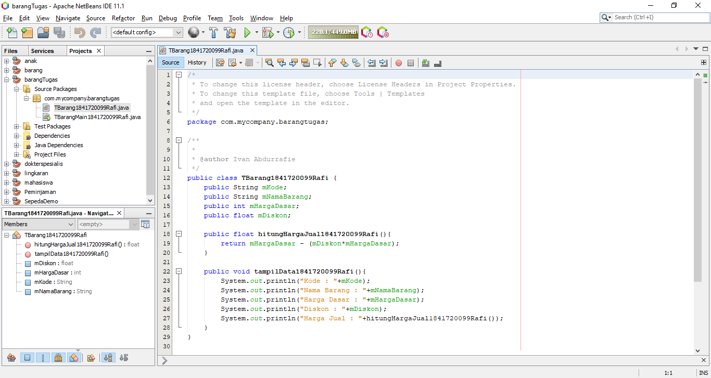

# Laporan Praktikum #2 - Class dan Object

## Kompetensi

1. Mahasiswa dapat memahami deskripsi dari class dan object
2. Mahasiswa memahami implementasi dari class
3. Mahasiswa dapat memahami implementasi dari attribute
4. Mahasiswa dapat memahami implementasi dari method
5. Mahasiswa dapat memahami implementasi dari proses instansiasi
6. Mahasiswa dapat memahami implementasi dari try-catch
7. Mahasiswa dapat memahami proses pemodelan class diagram menggunakan UML

## Ringkasan Materi

Kita bisa memanggil class induk pada class grandchild dengan cara super

Class Parent

link kode program Kakek.java : [Kakek.java](../../src/2_Class_dan_Object/ringkasan/Kakek.java)

Class Child

link kode program Ayah.java : [Ayah.java](../../src/2_Class_dan_Object/ringkasan/Ayah.java)

Class grandchild

link kode program Anak.java : [Anak.java](../../src/2_Class_dan_Object/ringkasan/Anak.java)

Class Main

link kode program Main.java : [Main.java](../../src/2_Class_dan_Object/ringkasan/AnakMain.java)

Hasil

 
## Percobaan

### Percobaan 1

Membuat Class Diagram

    Membuat class Karyawan 

### Percobaan 2

Membuat program berdasarkan class diagram yang telah disediakan

    class diagram Mahasiswa

    Class Mahasiswa 

link kode program Mahasiswa.java : [Mahasiswa.java](../../src/2_Class_dan_Object/Mahasiswa1841720099Rafi.java)

    Class Mahasiswa Main

    Hasil Program

link kode program Mahasiswa.java : [MahasiswaMain.java](../../src/2_Class_dan_Object/MahasiswaMain1841720099Rafi.java)

### Percobaan 3

    Barang

link kode program Barang.java : [Barang.java](../../src/2_Class_dan_Object/Barang1841720099Rafi.java)

    Barang Main

    Hasil

link kode program Barang Main.java : [BarangMain.java](../../src/2_Class_dan_Object/BarangMain1841720099Rafi.java)

## Pertanyaan

1. Apakah fungsi argumen dalam suatu method?
2. Ambil kesimpulan tentang kegunaan dari kata kunci return , dan kapan suatu method
harus memiliki return!

## Jawaban

1. Kegunaan arguman dalam suatu method adalah memberikan sebuah nilai yang harus dieksekusi oleh suatu method tersebut.
2.  Return adalah method yang mengembalikan nilai secara langsung atau sebuah nilai dari variable, ketika suatu method memiliki tipe data. Seperti int,double,float dll.

## Tugas

### Tugas 1

Class Diagram Peminjaman video Game

### tugas 2
#### Peminjaman Video Game

Source

link kode program Peminjaman.java : [Peminjaman.java](../../src/2_Class_dan_Object/Peminjaman1841720099Rafi.java)

##### Peminjaman Main

Source

Hasil 

link kode program Peminjaman Main.java : [PeminjamanMain.java](../../src/2_Class_dan_Object/PeminjamanMain1841720099Rafi.java)

### tugas 3

#### Lingkaran

Source

link kode program Lingkaran.java : [Lingkaran.java](../../src/2_Class_dan_Object/Lingkaran1841720099Rafi.java)

##### Lingkaran Main

Source

Hasil 

link kode program Lingkaran Main.java : [LingkaranMain.java](../../src/2_Class_dan_Object/PeminjamanMain1841720099Rafi.java)

### tugas 4

#### Barang

Source

link kode program Barang.java : [Barang.java](../../src/2_Class_dan_Object/TBarang1841720099Rafi.java)

##### Barang Main

Source

Hasil 

link kode program Barang Main.java : [BarangMain.java](../../src/2_Class_dan_Object/TBarangMain1841720099Rafi.java)

## Kesimpulan

Dengan menggambarkan class diagram mempermudah kita untuk merancang sebuah program. Dengan Menggunakan Object kita dapat mencegah pengulangan data yang sama. 

## Pernyataan Diri

Saya menyatakan isi tugas, kode program, dan laporan praktikum ini dibuat oleh saya sendiri. Saya tidak melakukan plagiasi, kecurangan, menyalin/menggandakan milik orang lain.

Jika saya melakukan plagiasi, kecurangan, atau melanggar hak kekayaan intelektual, saya siap untuk mendapat sanksi atau hukuman sesuai peraturan perundang-undangan yang berlaku.

Ttd,

***(Ivan Abdurrafie)***