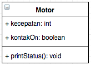

# Laporan Praktikum #3 - Enkapsulasi

## Kompetensi
Setelah melakukan percobaan pada modul ini, mahasiswa memahami konsep:
1. Konstruktor
2. Akses Modifier
3. Atribut/method pada class
4. Instansiasi atribut/method
5. Setter dan getter
6. Memahami notasi pada UML Class Diagram

## Ringkasan Materi
Melakukan praktikum berdasarkan materi enkapsulasi, melakukan proses inputan dari console, membuat method getter and setter, membuat menu di tugas ke 6.

 
## Percobaan

### Percobaan 1

Melakukan praktikum enkapsulasi dengan contoh Motor

1. Membuat Class Motor
   
##### Membuat class motor berdasarkan UML

##### Project

##### Source code 

   

 

link kode program Motor.java : [Motor.java](../../src/3_Enkapsulasi/Motor1841720099Rafi.java)

2. Membuat Class MotorDemo 
   
##### Source code 

   

 

##### Hasil

link kode program MotorDemo.java : [MotorDemo.java](../../src/3_Enkapsulasi/MotorDemo1841720099Rafi.java)

### Percobaan 2

##### Mengubah cara kerja class motor berdasarkan UML 

##### Mengubah access modifier pada kotak merah dan menambahkan method baru pada kotak hijau

link kode program Motor.java : [Motor.java](../../src/3_Enkapsulasi/Motor1841720099Rafi.java)

##### Merubah source code pada MotorDemo

##### Hasil dari percobaan

##### Pertanyaan 

1. Pada class TestMobil, saat kita menambah kecepatan untuk pertama kalinya, mengapa
muncul peringatan “Kecepatan tidak bisa bertambah karena Mesin Off!”?
2. Mengapat atribut kecepatan dan kontakOn diset private?
3. Ubah class Motor sehingga kecepatan maksimalnya adalah 100!
   
##### Jawaban

1. Ketika Kita ingin menambahkan kecepatan untuk pertama kalinya, kita harus menyalakan mesin terlebih dahulu

2. agar hanya bisa diakses oleh class yang sama, hanya bisa diakses oleh class Motor
3.  Dengan menambahkan statment pada method tambah kecepatan yaitu ketika kecepatan melebihi 100 maka output kecepatan akan menjadi 100 dan akan mendapatkan pesan yaitu Kecepatan sudah mencapai maximum

### Percobaan 3

##### Percobaan getter and setter menggunakan studi kasus Mahasiswa

##### UML

##### Membuat Class Anggota

link kode program Anggota.java : [Anggota.java](../../src/3_Enkapsulasi/Anggota1841720099Rafi.java)

##### Membuat Class KoperasiDemo

##### Hasil

link kode program KoperasiDemo.java : [KoperasiDemo.java](../../src/3_Enkapsulasi/KoperasiDemo1841720099Rafi.java)

### Percobaan 4

##### Meng edit CLass KoperasiDemo

##### Menambahkan constructor pada Class Anggota

##### Hasil

## Pertanyaan

1.  Apa yang dimaksud getter dan setter?
2. Apa kegunaan dari method getSimpanan()?
3. Method apa yang digunakan untk menambah saldo?
4. Apa yand dimaksud konstruktor?
5. Sebutkan aturan dalam membuat konstruktor?
6. Apakah boleh konstruktor bertipe private?
7. Kapan menggunakan parameter dengan passsing parameter?
8. Apa perbedaan atribut class dan instansiasi atribut?
9. Apa perbedaan class method dan instansiasi method?

## Jawaban

1. Getter adalah sebuah method yang memiliki tipe data return yang berfungsi untuk mendapatkan nilai dari attribut private, sedangkan Setter adalah sebuah method yang tidak memiliki tipe data return yang berfungsi untuk memanipulasi nilai dari attribut private.
2. Kegunaan dari method getSimpanan() adalah mengambil nilai dari attribut Simpanan 
3. setorRafi()
4. Constructor adalah method khusus yang dijalankan secara otomatis pada saat sebuah objek dibuat (instansiasi)
5. Aturan dalam pembuatan konstruktor :
   
   a. Nama konstruktor harus sama dengan nama class

   b. Konstruktor tidak memiliki tipe data return

   c. Konstruktor tidak boleh menggunakan modifier abstract, static, final, dan syncronized

6. Constructor pada java boleh memiliki tipe private,protected, public or default.
7. pada saat instansiasi objek
8. - Atribut class adalah suatu nilai data yang             terdapat pada suatu objek yang berasal dari class
    - instansiasi atribut adalah variabel yang didefinisikan di dalam suatu metod dan hanya menjadi milik dari instance kelas
9.  - class method merupakan sebuah method di dalam         suatu class
    - instansiasi method merupakan pemanggilan method dari class yang objeknya sudah di instansiasi
  
## Tugas

### Tugas 1

Membuat class Encapsulasi

Membuat class main

Hasil 

### Tugas 2

Ketika umur Melebihi 30 akan masuk kedalam statement mNewAge > 30 lalu nilai dari mAge akan di set menjadi 30

### Tugas 3

Berfungsi untuk melimit inputan umur agar hasilnya maksimal 30 dan minimal 18, jika inputan lebih dari 30 atau kurang dari 18 maka nilai akan di set sesuai nilai maksimal 30 atau nilai minimum 18

link kode program EncapDemo.java : [EncapDemo.java](../../src/3_Enkapsulasi/EncapDemo1841720099Rafi.java)

link kode program EncapTest.java : [EncapTest.java](../../src/3_Enkapsulasi/EncapTest1841720099Rafi.java)

### Tugas 4

Membuat Class Koperasi

link kode program Koperasi.java : [Koperasi.java](../../src/3_Enkapsulasi/Koperasi1841720099Rafi.java)

Membuat Class KoperasiMain 

link kode program KoperasiMain.java : [KoperasiMain.java](../../src/3_Enkapsulasi/KoperasiMain1841720099Rafi.java)

Hasil

### Tugas 5
dengan menambahkan 'var = 10 * this.mPinjamam / 100' agar mencari nilai 10% dari pinjaman, jika angsuran kurang dari 10% pinjaman maka akan terdapat pesan yaitu "Maaf, angsuran harus minimal 10% dari jumlah pinjaman"

hasil

### Tugas 6

Agar dapat menerima inputan console memakai Scanner, dan disini saya membuat menu agar mudah untuk mengakses method

hasil 

link kode program Koperasi.java : [Koperasi.java](../../src/3_Enkapsulasi/Koperasi1841720099Rafi.java)

link kode program KoperasiMain.java : [KoperasiMain.java](../../src/3_Enkapsulasi/KoperasiMain1841720099Rafi.java)

## Kesimpulan

Dari praktikum diatas kita diajarkan cara penggunaan getter and setter juga membuat program dari sebuah diagram UML 

## Pernyataan Diri

Saya menyatakan isi tugas, kode program, dan laporan praktikum ini dibuat oleh saya sendiri. Saya tidak melakukan plagiasi, kecurangan, menyalin/menggandakan milik orang lain.

Jika saya melakukan plagiasi, kecurangan, atau melanggar hak kekayaan intelektual, saya siap untuk mendapat sanksi atau hukuman sesuai peraturan perundang-undangan yang berlaku.

Ttd,

***(Ivan Abdurrafie)***