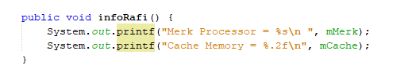
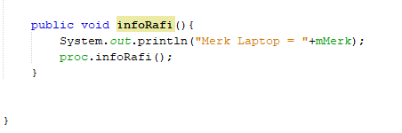
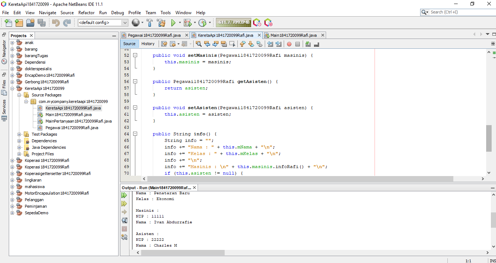
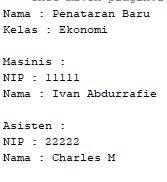
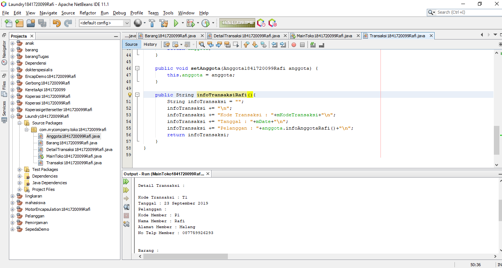

# Laporan Praktikum #4 - Relasi Kelas

## Kompetensi
Setelah menempuh pokok bahasan ini, mahasiswa mampu:
1. Memahami konsep relasi kelas;
2. Mengimplementasikan relasi has‑a dalam program.

## Ringkasan Materi
Melakukan praktikum Relasi kelas ini kita belajar cara membuat class yang ber relasi satu dengan class lain dengan memanggil suatu objek dengan menggunakan constructor dan method getter and setter serta mengimplementasikan Class diagram kedalam program 

 
## Percobaan

### Percobaan 1

Melakukan praktikum Relasi Kelas dengan studi kasus Laptop dan Processor

   
##### Membuat class Laptop dan processor berdasarkan UML

##### Class Processor
   
###### Source code 

   

   

   

###### Link code 

link kode program Processor.java : [Processor.java](../../src/4_Relasi_Class/Processor1841720099Rafi.java)

##### Class Laptop

###### Source code 

   

   

   

###### Link code 

link kode program Laptop.java : [Laptop.java](../../src/4_Relasi_Class/Laptop1841720099Rafi.java)

##### Main

###### Source code 

   

###### Link code 

link kode program Main.java : [Main.java](../../src/4_Relasi_Class/MainPercobaan11841720099Rafi.java)

##### Hasil

##### Pertanyaan

1. Di dalam class Processor dan class Laptop , terdapat method setter dan getter untuk
masing‑masing atributnya. Apakah gunanya method setter dan getter tersebut ?
2. Di dalam class Processor dan class Laptop, masing‑masing terdapat konstruktor
default dan konstruktor berparameter. Bagaimanakah beda penggunaan dari kedua jenis
konstruktor tersebut ?
3. Perhatikan class Laptop, di antara 2 atribut yang dimiliki (merk dan proc), atribut
manakah yang bertipe object ?
4. Perhatikan class Laptop, pada baris manakah yang menunjukan bahwa class Laptop
memiliki relasi dengan class Processor ?
5. Perhatikan pada class Laptop , Apakah guna dari sintaks proc.info() ?
6. Pada class MainPercobaan1, terdapat baris kode:
Laptop l = new Laptop("Thinkpad", p);.
Apakah p tersebut ?
Dan apakah yang terjadi jika baris kode tersebut diubah menjadi:
Laptop l = new Laptop("Thinkpad", new Processor("Intel i5",
3));
Bagaimanakah hasil program saat dijalankan, apakah ada perubahan ?

##### Jawaban

1. getter adalah sebuah method untuk membaca atau read isi atau value dari sebuah variabel sedangkan setter adalah sebuah method untuk merubah atau update isi atau value dari sebuah variabel
2. perbedaan penggunaan dari konstruktor default dan berparameter adalah jika kita ingin mengisikan value pada saat instansiasi objek kita memakai konstruktor berparameter seperti di kotak biru, sedangkan jika kita ingin mengisikan value setelah instansiasi dilakukan maka kita memakai konstruktor default yang tidak berparameter seperti di kotak merah
   

3. attribut yang bertipe objek pada class laptop adalah attribut proc
4. baris yang menunjukan bahwa class laptop memiliki relasi dengan class processor berada di baris ke 15
   

5. kegunaan dari sintaks proc.info() adalah memanggil method info dari object yang bernama proc
6. p adalah sebuah instansiasi dari object processor,
 hasil dari kedua percobaan diatas adalah sama karena di kedua sintaks sama sama mengisi value dari object processor

### Percobaan 2

##### Relasi Kelas Rental Mobil berdasarkan UML 

##### Class Mobil

###### Source code

###### Link code 

link kode program Mobil.java : [Mobil.java](../../src/4_Relasi_Class/Mobil1841720099Rafi.java)

##### Class Sopir

###### Source code

###### Link code 

link kode program Sopir.java : [Sopir.java](../../src/4_Relasi_Class/Sopir1841720099Rafi.java)

##### Class Pelanggan

###### Source code

###### Link code 

link kode program Pelanggan.java : [Pelanggan.java](../../src/4_Relasi_Class/Pelanggan1841720099Rafi.java)

##### Main

###### Source code 

   

###### Link code 

link kode program Main.java : [Main.java](../../src/4_Relasi_Class/Main1841720099Rafi.java)

##### Hasil

##### Pertanyaan

1. Perhatikan class Pelanggan. Pada baris program manakah yang menunjukan bahwa class
Pelanggan memiliki relasi dengan class Mobil dan class Sopir ?
2. Perhatikan method hitungBiayaSopir pada class Sopir, serta method
hitungBiayaMobil pada class Mobil. Mengapa menurut Anda method tersebut harus
memiliki argument hari ?
3. Perhatikan kode dari class Pelanggan. Untuk apakah perintah
mobil.hitungBiayaMobil(hari) dan sopir.hitungBiayaSopir(hari) ?
4. Perhatikan class MainPercobaan2. Untuk apakah sintaks p.setMobil(m) dan
p.setSopir(s) ?
5. Perhatikan class MainPercobaan2. Untuk apakah proses p.hitungBiayaTotal()
tersebut ?
6. Perhatikan class MainPercobaan2, coba tambahkan pada baris terakhir dari method
main dan amati perubahan saat di‑run!
System.out.println(p.getMobil().getMerk());
Jadi untuk apakah sintaks p.getMobil().getMerk() yang ada di dalam method main
tersebut?

##### Jawaban

1. yang menunjukkan relasi class pelanggan dengan class mobil dan class sopir pada baris ke 15 dan 16

2. agar jumlah hari atau lamanya sewa hari bisa di inputkan oleh user
3. untuk menghitung biaya dari sewa mobil dikalikan dengan hari dan menghitung sewa sopir dikalikan dengan hari
4. untuk mengeset agar value mobil sesuai dengan instansiasi object m pada class mobil dan set value sopir sesuai dengan instansiasi object s pada class sopir
5. untuk menghitung total biaya sesuai dengan harga mobil dikalikan dengan hari lama sewa dan ditambahkan dengan sopir dikalikan dengan hari lama sewa
6. fungsi dari sintaks tersebut adalah menampilkan merek dari class mobil yang sedang dipinjam oleh pelanggan

### Percobaan 3

##### Relasi Kelas Masinis dan kereta api berdasarkan UML 

##### Class Pegawai

###### Source code

###### Link code 

link kode program Pegawai.java : [Pegawai.java](../../src/4_Relasi_Class/Pegawai1841720099Rafi.java)

##### Class Kereta Api

###### Source code

###### Link code 

link kode program KeretaApi.java : [KeretaApi.java](../../src/4_Relasi_Class/KeretaApi1841720099Rafi.java)

##### Main

###### Source code 

   

###### Link code 

link kode program Main.java : [Main.java](../../src/4_Relasi_Class/MainKereta1841720099Rafi.java)

##### Hasil

##### Pertanyaan

1. Di dalam method info() pada class KeretaApi, baris this.masinis.info() dan
this.asisten.info() digunakan untuk apa ?
2. Buatlah main program baru dengan nama class MainPertanyaan pada package yang
sama. Tambahkan kode berikut pada method main() !
Pegawai masinis = new Pegawai("1234", "Spongebob
Squarepants");
KeretaApi keretaApi = new KeretaApi("Gaya Baru", "Bisnis",
masinis);
System.out.println(keretaApi.info());
3. Apa hasil output dari main program tersebut ? Mengapa hal tersebut dapat terjadi ?
4. Perbaiki class KeretaApi sehingga program dapat berjalan !

##### Jawaban

1. untuk menampilkan info pada method masinis dan info pada method asisten
2. membuat main program baru

3. terjadi sebuah error null pointer exception karena pada assisten tidak terisi
 
 4. menggunakan statement if pada kereta.info, jika data assisten ditambahkan maka akan ditampilkan jika tidak maka data assisten tidak ditampilkan

### Percobaan 4

##### Relasi Kelas gerbong, penumpang dan kursi berdasarkan UML 

##### Class Penumpang

###### Source code

###### Link code 

link kode program Penumpang.java : [Penumpang.java](../../src/4_Relasi_Class/Penumpang1841720099Rafi.java)

##### Class Kursi

###### Source code

###### Link code 

link kode program Kursi.java : [kursi.java](../../src/4_Relasi_Class/Kursi1841720099Rafi.java)

##### Class Gerbong

###### Source code

###### Link code 

link kode program Gerbong.java : [Gerbong.java](../../src/4_Relasi_Class/Gerbong1841720099Rafi.java)

##### Main

###### Source code 

   

###### Link code 

link kode program Main.java : [Main.java](../../src/4_Relasi_Class/MainGerbong1841720099Rafi.java)

##### Hasil

##### Pertanyaan

1. Pada main program dalam class MainPercobaan4, berapakah jumlah kursi dalam
Gerbong A ?
2. Perhatikan potongan kode pada method info() dalam class Kursi. Apa maksud kode
tersebut ?
...
if (this.penumpang != null) {
info += "Penumpang: " + penumpang.info() + "\n";
}
...
3. Mengapa pada method setPenumpang() dalam class Gerbong, nilai nomor dikurangi
dengan angka 1 ?
4. Instansiasi objek baru budi dengan tipe Penumpang, kemudian masukkan objek baru
tersebut pada gerbong dengan gerbong.setPenumpang(budi, 1). Apakah yang
terjadi ?
5. Modifikasi program sehingga tidak diperkenankan untuk menduduki kursi yang sudah ada
penumpang lain !

##### Jawaban

1. jumlah kursi dalam gerbong A adalah 10
2. pada source tersebut info penumpang akan ditampilkan jika value penumpang tidak kosong, jika kosong maka tidak akan menampilkan info penumpang tersebut
3. karena pada array dimulai dari angka 0
4. Pada kursi nomor satu penumpang akan berubah menjadi budi karena data tertimpa
5. modifikasi source program

## Tugas

### Tugas 1

##### Relasi Kelas dengan Studi Kasus Toko

##### Class Anggota

###### Source code

###### Link code 

link kode program Anggota.java : [Anggota.java](../../src/4_Relasi_Class/Anggota1841720099Rafi.java)

##### Class Barang

###### Source code

###### Link code 

link kode program Barang.java : [Barang.java](../../src/4_Relasi_Class/Barang1841720099Rafi.java)

##### Class Transaksi

###### Source code

###### Link code 

link kode program Transaksi.java : [Transaksi.java](../../src/4_Relasi_Class/Transaksi1841720099Rafi.java)

##### Class Detail Transaksi

###### Source code

###### Link code 

link kode program Detail.java : [Detail.java](../../src/4_Relasi_Class/DetailTransaksi1841720099Rafi.java)

##### Main

###### Source code 

   

###### Link code 

link kode program Main.java : [Main.java](../../src/4_Relasi_Class/MainGerbong1841720099Rafi.java)

##### Hasil

## Kesimpulan

Dari praktikum diatas kita diajarkan cara pembuatan Relasi Kelas menggunakan method getter and setter juga membuat rancangan Class diagram menggunakan uml serta mengimplementasikannya kedalam program

## Pernyataan Diri

Saya menyatakan isi tugas, kode program, dan laporan praktikum ini dibuat oleh saya sendiri. Saya tidak melakukan plagiasi, kecurangan, menyalin/menggandakan milik orang lain.

Jika saya melakukan plagiasi, kecurangan, atau melanggar hak kekayaan intelektual, saya siap untuk mendapat sanksi atau hukuman sesuai peraturan perundang-undangan yang berlaku.

Ttd,

***(Ivan Abdurrafie)***