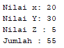
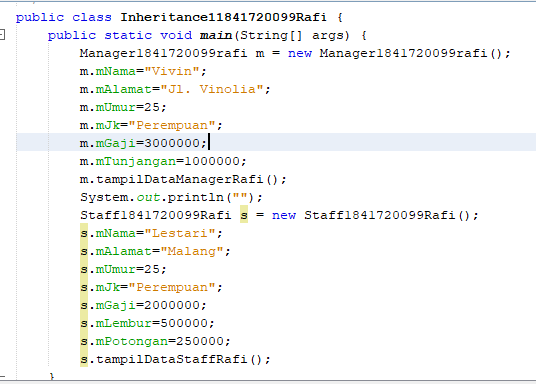
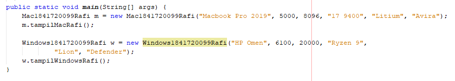

# Laporan Praktikum #6 - Inheritance

## Kompetensi
1. Memahami  konsep  dasar inheritance  atau  pewarisan. 
2. Mampu  membuat  suatu  subclass dari  suatu  superclass  tertentu. 
3. Mampu  mengimplementasikan konsep  single  dan  multilevel inheritance. 
4. Mampu  membuat  objek  dari suatu  subclass  dan melakukan pengaksesan  terhadap  atribut dan method baik  yang  dimiliki sendiri  atau  turunan  dari superclass  nya. 

## Ringkasan Materi
dalam inheritance kita bisa memanggil attribut ataupun method pada class parent menggunakan super digunakan untuk menghemat code karena tidak mengulang penulisan kode berulang kali


 
## Percobaan

### Percobaan 1
##### Class A


link kode program ClassA.java : [ClassA.java](../../src/6_Inheritance/P1ClassA1841720099Rafi.java)

##### Class B


link kode program ClassB.java : [ClassB.java](../../src/6_Inheritance/P1ClassB1841720099Rafi.java)


##### Main


link kode program Main.java : [Main.java](../../src/6_Inheritance/Percobaan11841720099Rafi.java)

##### Hasil


##### Pertanyaan

1. Pada  percobaan  1  diatas  program  yang  dijalankan  terjadi error,  kemudian  perbaiki  sehingga program  tersebut  bisa  dijalankan  dan  tidak  error! 


    ```java
    dengan menambahkan extends ke Class B      
    ClassB1841720099Rafi extends ClassA1841720099Rafi{}
    ```
    

2. Jelaskan  apa  penyebab  program  pada  percobaan  1  ketika  dijalankan  terdapat  error! 
   
        dibutuhkan fungsi extends agar bisa memakai fungsi atau attribut dari class parent

### Percobaan 2

##### Class A


link kode program ClassA.java : [ClassA.java](../../src/6_Inheritance/P2ClassA1841720099Rafi.java)

##### Class B


link kode program ClassB.java : [ClassB.java](../../src/6_Inheritance/P2ClassB1841720099Rafi.java)


##### Main


link kode program Main.java : [Main.java](../../src/6_Inheritance/Percobaan11841720099Rafi.java)

##### Hasil



##### Pertanyaan

1.Pada  percobaan  2  diatas  program  yang  dijalankan  terjadi  error,  kemudian  perbaiki  sehingga program  tersebut  bisa  dijalankan  dan  tidak  error! 

        dengan menambahkan fungsi get kita bisa memanggil attribut dari class parent yang ber modifier private
``` java
    public int getmX() {
        return mX;
    }
    public int getmY() {
        return mY;
    }
```
    

2. Jelaskan  apa  penyebab  program  pada  percobaan  2  ketika  dijalankan  terdapat  error! 
   
        karena attribut yang akan dipanggil ber modifier private sehingga tidak bisa diakses untuk class lain yang bukan turunannya

### Percobaan 3 (Super)

##### Class Bangun


link kode program ClassBangun.java : [ClassBangun.java](../../src/6_Inheritance/Bangun1841720099Rafi.java)

##### Class Tabung


link kode program ClassTabung.java : [ClassTabung.java](../../src/6_Inheritance/Tabung1841720099Rafi.java)


##### Main


link kode program Main.java : [Main.java](../../src/6_Inheritance/P3Main1841720099Rafi.java)

##### Hasil


##### Pertanyaan

1. Jelaskan  fungsi   “super”  pada  potongan  program  berikut  di  class  Tabung! 


    super.nama attribut berfungsi untuk memanggil attribut pada class parent
    

2. Jelaskan  fungsi  “super”  dan  “this”  pada  potongan  program  berikut  di  class  Tabung! 
   


    fungsi super adalah untuk memanggil attribut dari class parent dan fungsi this untuk memanggil atrribut yang berada di classnya sendiri

3. Jelaskan  mengapa  pada  class  Tabung  tidak  dideklarasikan  atribut  “phi”  dan  “r”  tetapi  class tersebut  dapat  mengakses  atribut  tersebut! 

        karena sudah attribut phi dan r sudah terdapat di class parent maka class turunannya bisa memanggil attribut yang diinginkan 

### Percobaan 4  (super  contsructor)

##### Class A


link kode program ClassA.java : [ClassA.java](../../src/6_Inheritance/P4ClassA1841720099Rafi.java)

##### Class B


link kode program ClassB.java : [ClassB.java](../../src/6_Inheritance/P4ClassB1841720099Rafi.java)

##### Class C


link kode program ClassC.java : [ClassC.java](../../src/6_Inheritance/P4ClassC1841720099Rafi.java)

##### Main


link kode program Main.java : [Main.java](../../src/6_Inheritance/P4Main1841720099Rafi.java)

##### Hasil


##### Pertanyaan

1. Pada  percobaan  4  sebutkan  mana  class  yang  termasuk  superclass  dan  subclass,  kemudian 
jelaskan  alasannya!  

       superclass : ClassA1841720099Rafi, Subclass : ClassB1841720099Rafi dan ClassC1841720099Rafi karena Class B dan Class C memanggil parent Class A dengan menggunakan extends
    

2.  Ubahlah  isi  konstruktor  default  ClassC  seperti  berikut:  
   
    

    Tambahkan  kata  super()  di  baris  Pertaman dalam  konstruktor  defaultnya.  Coba  jalankan kembali  class  Percobaan4  dan  terlihat  tidak ada perbedaan  dari  hasil  outputnya! 

3. Ublah  isi  konstruktor  default  ClassC  seperti  berikut:  

     

    Ketika  mengubah  posisi  super()  dibaris  kedua  dalam  kontruktor  defaultnya  dan  terlihat  ada error.  Kemudian  kembalikan  super()  kebaris pertama  seperti  sebelumnya,  maka  errornya akan hilang. 

    Perhatikan hasil keluaran ketika class Percobaan4 dijalankan. Kenapa bisa tampil output seperti berikut pada saat instansiasi  objek test dari class ClassC 

     

    Jelaskan bagaimana urutan proses jalannya konstruktor saat objek test dibuat!

        Urutan proses jalannya Constructor adalah mulai dari constructor dari class parent lalu sub class akan dijalankan sesuai tingkat sub classnya

4. Apakah fungsi super() pada potongan program dibawah ini di ClassC! 

     

        fungsi super() pada potongan program diatas adalah untuk memanggil constructor dari class parent

### Percobaan 5

##### Class Karyawan


link kode program Karyawan.java : [Karyawan.java](../../src/6_Inheritance/Karyawan1841720099Rafi.java)

##### Class Manager


link kode program Manager.java : [Manager.java](../../src/6_Inheritance/Manager1841720099Rafi.java)

##### Class Staff


link kode program Staff.java : [Staff.java](../../src/6_Inheritance/Staff1841720099Rafi.java)

##### Main




link kode program Main.java : [Main.java](../../src/6_Inheritance/P5Inheritance11841720099Rafi.java)

##### Hasil


##### Pertanyaan

1. Sebutkan class mana yang termasuk super class dan sub class dari percobaan 5 diatas!   

       superclass : Karyawan1841720099Rafi, Subclass : Staff1841720099Rafi dan Manager1841720099Rafi 
    

2.  Kata kunci apakah yang digunakan untuk menurunkan suatu class ke class yang lain?  
   
        kata kunci yang digunakan untuk menurunkan suatu class ke class yang lain adalah extends

3. Perhatikan kode program pada class Manager, atribut apa saja yang dimiliki oleh class tersebut? Sebutkan atribut mana saja yang diwarisi dari class Karyawan!   

        attribut yang diimiliki class manager adalah mTunjangan dan attribut yang diwarisi oleh class Karyawan adalah mGaji
 
4. Jelaskan kata kunci super pada potongan program dibawah ini yang terdapat pada class Manager! 

     

        super pada potongan program diatas adalah untuk memanggil attribut gaji dari class karyawan yang menjadi parent dari class manager untuk menentukan total gaji dengan menambahkan gaji dengan tunjangan

5. Program pada percobaan 1 diatas termasuk dalam jenis inheritance apa? Jelaskan alasannya! 
   
         jenis inheritance hirarki karena terdapat dua subclass yang terkait pada class parent


### Percobaan 6

Menambahkan Class StaffHarian dan StaffTetap berdasarkan Percobaan 5

##### Class StaffTetap


link kode program StaffTetap.java : [StaffTetap.java](../../src/6_Inheritance/StaffTetap1841720099Rafi.java)

##### Class StaffHarian


link kode program StaffHarian.java : [StaffHarian.java](../../src/6_Inheritance/StaffHarian1841720099Rafi.java)

##### Main


link kode program Main.java : [Main.java](../../src/6_Inheritance/Inheritance11841720099Rafi.java)

##### Hasil


##### Pertanyaan

1. Berdasarkan class diatas manakah yang termasuk single inheritance dan mana yang termasuk multilevel inheritance?   

       Class diatas berjenis multilevel inheritance 
    

2.  Perhatikan kode program class StaffTetap dan StaffHarian, atribut apa saja yang dimiliki oleh class tersebut Sebutkan atribut mana saja yang diwarisi dari class Staff!  

        attribut yang dimiliki StaffTetap adalah mGolongan dan mAsuransi sedangkan attribut yang dimiliki oleh StaffHarian adalah mJmlJamkerja dan attribut yang diwari oleh class staff adalah mLembur dan mPotongan

3. Apakah fungsi potongan program berikut pada class StaffHarian  

     

        memanggil attribut nama,alamat,jk,umur,gaji,lembur dan potongan dari class parent
 
4. Apakah fungsi potongan program berikut pada class StaffHarian

     

        Memanggil fungsi tampilDataStaff pada class Staff yaitu parent dari StaffHarian

5. Perhatikan kode program dibawah ini yang terdapat  pada class StaffTetap 
   
    

    Terlihat dipotongan program diatas atribut gaji lembur dan potongan dapat diakses langsung. Kenapa hal ini bisa terjadi dan bagaimana class StaffTetap memiliki atribut gaji, lembur, dan potongan padahal dalam class tersebut tidak dideklarasikan atribut gaji, lembur, dan potongan? 

        dengan memanggil attribut dari class parent  

## Tugas

### Tugas 1

##### Class Komputer


link kode program Komputer.java : [Komputer.java](../../src/6_Inheritance/Komputer1841720099Rafi.java)

##### Class Laptop


link kode program Laptop.java : [Laptop.java](../../src/6_Inheritance/Laptop1841720099Rafi.java)

##### Class PC


link kode program PC.java : [PC.java](../../src/6_Inheritance/PC1841720099Rafi.java)

##### Class Mac


link kode program Mac.java : [Mac.java](../../src/6_Inheritance/Mac1841720099Rafi.java)

##### Class Windows


link kode program Windows.java : [Windows.java](../../src/6_Inheritance/Windows1841720099Rafi.java)

##### Main




link kode program Main.java : [Main.java](../../src/6_Inheritance/TMain1841720099Rafi.java)

##### Hasil


## Kesimpulan

Dari praktikum diatas kita diajarkan cara penerapan dari inheritance dengan menggunakan extends dan super pada subclass yang ingin dituju

## Pernyataan Diri

Saya menyatakan isi tugas, kode program, dan laporan praktikum ini dibuat oleh saya sendiri. Saya tidak melakukan plagiasi, kecurangan, menyalin/menggandakan milik orang lain.

Jika saya melakukan plagiasi, kecurangan, atau melanggar hak kekayaan intelektual, saya siap untuk mendapat sanksi atau hukuman sesuai peraturan perundang-undangan yang berlaku.

Ttd,

***(Ivan Abdurrafie)***