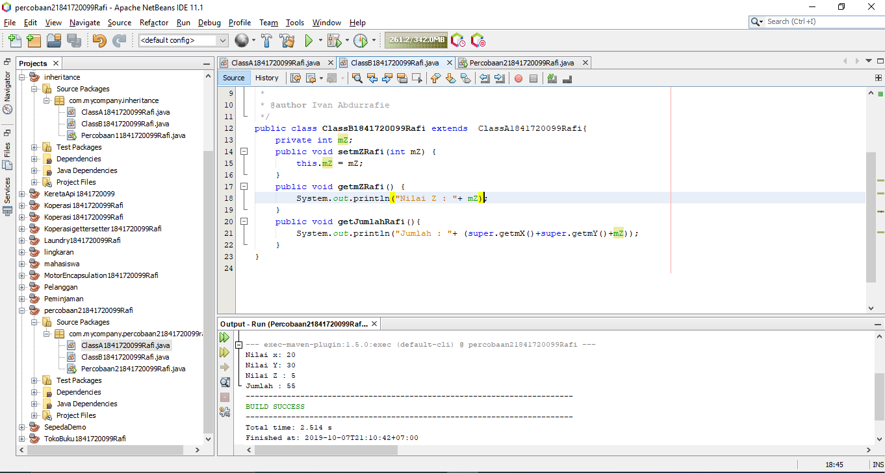
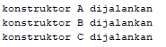

# Laporan Praktikum #6 - Inheritance

## Kompetensi
1. Memahami  konsep  dasar inheritance  atau  pewarisan. 
2. Mampu  membuat  suatu  subclass dari  suatu  superclass  tertentu. 
3. Mampu  mengimplementasikan konsep  single  dan  multilevel inheritance. 
4. Mampu  membuat  objek  dari suatu  subclass  dan melakukan pengaksesan  terhadap  atribut dan method baik  yang  dimiliki sendiri  atau  turunan  dari superclass  nya. 

## Ringkasan Materi


 
## Percobaan

### Percobaan 1
##### Class A


link kode program ClassA.java : [ClassA.java](../../src/6_Inheritance/P1ClassA1841720099Rafi.java)

##### Class B


link kode program ClassB.java : [ClassB.java](../../src/6_Inheritance/P1ClassB1841720099Rafi.java)


##### Main


link kode program Main.java : [Main.java](../../src/6_Inheritance/Percobaan11841720099Rafi.java)

##### Hasil


##### Pertanyaan

1. Pada  percobaan  1  diatas  program  yang  dijalankan  terjadi error,  kemudian  perbaiki  sehingga program  tersebut  bisa  dijalankan  dan  tidak  error! 


    ```java
    dengan menambahkan extends ke Class B      
    ClassB1841720099Rafi extends ClassA1841720099Rafi{}
    ```
    

2. Jelaskan  apa  penyebab  program  pada  percobaan  1  ketika  dijalankan  terdapat  error! 
   
        dibutuhkan fungsi extends agar bisa memakai fungsi atau attribut dari class parent

### Percobaan 2

##### Class A


link kode program ClassA.java : [ClassA.java](../../src/6_Inheritance/P2ClassA1841720099Rafi.java)

##### Class B




link kode program ClassB.java : [ClassB.java](../../src/6_Inheritance/P2ClassB1841720099Rafi.java)


##### Main


link kode program Main.java : [Main.java](../../src/6_Inheritance/Percobaan11841720099Rafi.java)

##### Hasil


##### Pertanyaan

1.Pada  percobaan  2  diatas  program  yang  dijalankan  terjadi  error,  kemudian  perbaiki  sehingga program  tersebut  bisa  dijalankan  dan  tidak  error! 

        dengan menambahkan fungsi get kita bisa memanggil attribut dari class parent yang ber modifier private
``` java
    public int getmX() {
        return mX;
    }
    public int getmY() {
        return mY;
    }
```
    

2. Jelaskan  apa  penyebab  program  pada  percobaan  2  ketika  dijalankan  terdapat  error! 
   
        karena attribut yang akan dipanggil ber modifier private sehingga tidak bisa diakses untuk class lain yang bukan turunannya

### Percobaan 3

##### Class A


link kode program ClassA.java : [ClassA.java](../../src/6_Inheritance/P2ClassA1841720099Rafi.java)

##### Class B


link kode program ClassB.java : [ClassB.java](../../src/6_Inheritance/P2ClassB1841720099Rafi.java)


##### Main


link kode program Main.java : [Main.java](../../src/6_Inheritance/Percobaan11841720099Rafi.java)

##### Hasil


##### Pertanyaan

1.Pada  percobaan  2  diatas  program  yang  dijalankan  terjadi  error,  kemudian  perbaiki  sehingga program  tersebut  bisa  dijalankan  dan  tidak  error! 

        dengan menambahkan fungsi get kita bisa memanggil attribut dari class parent yang ber modifier private
``` java
    public int getmX() {
        return mX;
    }
    public int getmY() {
        return mY;
    }
```
    

2. Jelaskan  apa  penyebab  program  pada  percobaan  2  ketika  dijalankan  terdapat  error! 
   
        karena attribut yang akan dipanggil ber modifier private sehingga tidak bisa diakses untuk class lain yang bukan turunannya

### Percobaan 4

##### Relasi Kelas gerbong, penumpang dan kursi berdasarkan UML 


##### Class Penumpang

###### Source code


###### Link code 

link kode program Penumpang.java : [Penumpang.java](../../src/4_Relasi_Class/Penumpang1841720099Rafi.java)

##### Class Kursi

###### Source code


###### Link code 

link kode program Kursi.java : [kursi.java](../../src/4_Relasi_Class/Kursi1841720099Rafi.java)

##### Class Gerbong

###### Source code


###### Link code 

link kode program Gerbong.java : [Gerbong.java](../../src/4_Relasi_Class/Gerbong1841720099Rafi.java)

##### Main

###### Source code 


   

###### Link code 

link kode program Main.java : [Main.java](../../src/4_Relasi_Class/MainGerbong1841720099Rafi.java)


##### Hasil



##### Pertanyaan

1. Pada main program dalam class MainPercobaan4, berapakah jumlah kursi dalam
Gerbong A ?
2. Perhatikan potongan kode pada method info() dalam class Kursi. Apa maksud kode
tersebut ?
...
if (this.penumpang != null) {
info += "Penumpang: " + penumpang.info() + "\n";
}
...
3. Mengapa pada method setPenumpang() dalam class Gerbong, nilai nomor dikurangi
dengan angka 1 ?
4. Instansiasi objek baru budi dengan tipe Penumpang, kemudian masukkan objek baru
tersebut pada gerbong dengan gerbong.setPenumpang(budi, 1). Apakah yang
terjadi ?
5. Modifikasi program sehingga tidak diperkenankan untuk menduduki kursi yang sudah ada
penumpang lain !

##### Jawaban

1. jumlah kursi dalam gerbong A adalah 10
2. pada source tersebut info penumpang akan ditampilkan jika value penumpang tidak kosong, jika kosong maka tidak akan menampilkan info penumpang tersebut
3. karena pada array dimulai dari angka 0
4. Pada kursi nomor satu penumpang akan berubah menjadi budi karena data tertimpa
5. modifikasi source program


## Tugas

### Tugas 1

##### Relasi Kelas dengan Studi Kasus Toko


##### Class Anggota

###### Source code


###### Link code 

link kode program Anggota.java : [Anggota.java](../../src/4_Relasi_Class/Anggota1841720099Rafi.java)

##### Class Barang

###### Source code


###### Link code 

link kode program Barang.java : [Barang.java](../../src/4_Relasi_Class/Barang1841720099Rafi.java)

##### Class Transaksi

###### Source code


###### Link code 

link kode program Transaksi.java : [Transaksi.java](../../src/4_Relasi_Class/Transaksi1841720099Rafi.java)

##### Class Detail Transaksi

###### Source code


###### Link code 

link kode program Detail.java : [Detail.java](../../src/4_Relasi_Class/DetailTransaksi1841720099Rafi.java)

##### Main

###### Source code 


   

###### Link code 

link kode program Main.java : [Main.java](../../src/4_Relasi_Class/MainGerbong1841720099Rafi.java)


##### Hasil


## Kesimpulan

Dari praktikum diatas kita diajarkan cara pembuatan Relasi Kelas menggunakan method getter and setter juga membuat rancangan Class diagram menggunakan uml serta mengimplementasikannya kedalam program

## Pernyataan Diri

Saya menyatakan isi tugas, kode program, dan laporan praktikum ini dibuat oleh saya sendiri. Saya tidak melakukan plagiasi, kecurangan, menyalin/menggandakan milik orang lain.

Jika saya melakukan plagiasi, kecurangan, atau melanggar hak kekayaan intelektual, saya siap untuk mendapat sanksi atau hukuman sesuai peraturan perundang-undangan yang berlaku.

Ttd,

***(Ivan Abdurrafie)***