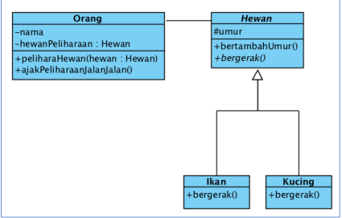
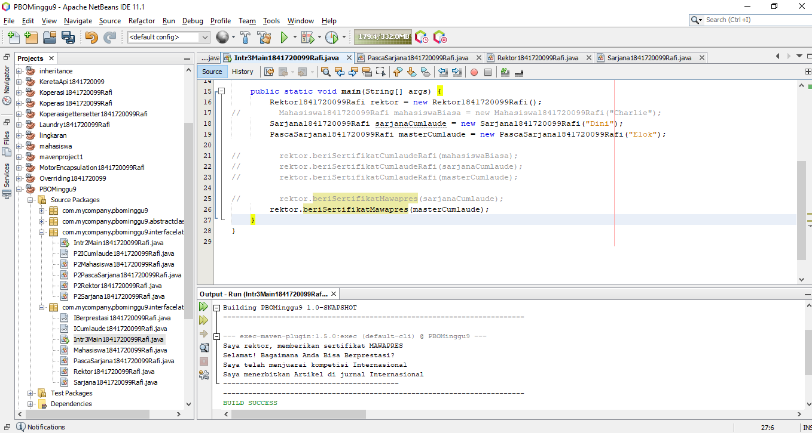

# Laporan Praktikum #9 - Abstract Class dan Interface

## Kompetensi
Setelah menempuh pokok bahasan ini, mahasiswa mampu :
1. Menjelaskan maksud dan tujuan penggunaan Abstract Class;
2. Menjelaskan maksud dan tujuan penggunaan Interface;
3. Menerapkan Abstract Class dan Interface di dalam pembuatan program.

## Ringkasan Materi
Penerapan dari abstract class dan interface, karakteristik serta fungsi dari abstract class dan interface itu sendiri

## Percobaan

### Percobaan 1

##### Class Diagram



##### Class Hewan


link kode program Hewan.java : [Hewan.java](../../src/9_Abstract_Class_dan_Interface/Hewan1841720099Rafi.java)

##### Class Kucing


link kode program Kucing.java : [Kucing.java](../../src/9_Abstract_Class_dan_Interface/Kucing1841720099Rafi.java)

##### Class Ikan


link kode program Ikan.java : [Ikan.java](../../src/9_Abstract_Class_dan_Interface/Ikan1841720099Rafi.java)

##### Class Orang


link kode program Orang.java : [Orang.java](../../src/9_Abstract_Class_dan_Interface/Orang1841720099Rafi.java)

##### Main


link kode program Main.java : [Main.java](../../src/9_Abstract_Class_dan_Interface/PboMain1841720099Rafi.java)

##### Hasil


#### Pertanyaan

1. Bolehkah apabila sebuah class yang meng-extend suatu abstract class tidak mengimplementasikan method abstract yang ada di class induknya? Buktikan!
   

        Boleh
         
    ``` java
            Hewan1841720099Rafi burung = new Hewan1841720099Rafi() {
            @Override
            public void bergerakRafi() {
                System.out.println("Terbang");
            }
        };
    ```
         
### Percobaan 2

##### Class Diagram


##### Interface *ICumlaude*


link kode program Interface ICumlaude.java : [ICumlaude.java](../../src/9_Abstract_Class_dan_Interface/P2ICumlaude1841720099Rafi.java)

##### Class Mahasiswa


link kode program Mahasiswa.java : [Mahasiswa.java](../../src/9_Abstract_Class_dan_Interface/P2Mahasiswa1841720099Rafi.java)

##### Class Sarjana


link kode program Sarjana.java : [Sarjana.java](../../src/9_Abstract_Class_dan_Interface/P2Sarjana1841720099Rafi.java)

##### Class Pasca Sarjana


link kode program Pascasarjana.java : [Pascasarjana.java](../../src/9_Abstract_Class_dan_Interface/P2Pascasarjana1841720099Rafi.java)

##### Class Rektor


link kode program Rektor.java : [Rektor.java](../../src/9_Abstract_Class_dan_Interface/P2Rektor1841720099Rafi.java)


##### Main


link kode program Main.java : [Main.java](../../src/9_Abstract_Class_dan_Interface/PboMain1841720099Rafi.java)

##### Hasil


#### Pertanyaan

1. Mengapa pada langkah nomor 9 terjadi error? Jelaskan!

        Interface tidak terkoneksi pada class mahasiswa

2. Dapatkah method kuliahDiKampus() dipanggil dari objek sarjanaCumlaude di class Program? Mengapa demikian?
   
        Bisa, dengan  menambahkan abstract method kuliahDiKampus() pada interface cumlaude 

         
    ``` java
            public interface ICumlaude1841720099Rafi {
            public abstract void lulusRafi();
            public abstract void meraihIPKTinggiRafi();
            public abstract void kuliahDiKampusRafi();
            }
    ```

3. Dapatkah method kuliahDiKampus() dipanggil dari parameter mahasiswa di method beriSertifikatCumlaude() pada class Rektor? Mengapa demikian?

        Bisa, Dengan menambahkan abstract method di interface cumlaude dan pada class rektor method kuliahDiKampus() dipanggil

4. Modifikasilah method beriSertifikatCumlaude() pada class Rektor agar hasil eksekusi class Program menjadi seperti berikut ini:
    ``` java


            public void beriSertifikatCumlaudeRafi(P2ICumlaude1841720099Rafi mahasiswa){
            System.out.println("Saya Rektor, memberikan sertifikat cumlaude.");
            System.out.println("Selamat! silahkan perkenalkan diri anda .");
            mahasiswa.kuliahDiKampusRafi();
            mahasiswa.lulusRafi();
            mahasiswa.meraihIPKTinggiRafi();
            System.out.println("--------------------------------------------");
            }
    ```

### Percobaan 3

##### Class Diagram


##### interface *IBerprestasi*


link kode program interface IBerprestasi.java : [IBerprestasi.java](../../src/9_Abstract_Class_dan_Interface/IBerprestasi1841720099Rafi.java)

##### Class Pasca Sarjana


link kode program Kucing.java : [Kucing.java](../../src/9_Abstract_Class_dan_Interface/Pascasarjana1841720099Rafi.java)

##### Class Rektor


link kode program Rektor.java : [Rektor.java](../../src/9_Abstract_Class_dan_Interface/Rektor1841720099Rafi.java)

##### Main




link kode program Main.java : [Main.java](../../src/9_Abstract_Class_dan_Interface/PboMain1841720099Rafi.java)

##### Hasil


#### Pertanyaan

1. Apabila Sarjana Berprestasi harus menjuarai kompetisi NASIONAL dan menerbitkan artikel di jurnal NASIONAL, maka modifikasilah class-class yang terkait pada aplikasi Anda agar di class Program objek pakRektor dapat memberikan sertifikat mawapres pada objek sarjanaCumlaude.
   
        Dengan mengoverride abstrak method dari interface IBerprestasi ke class Sarjana
         
    ``` java
           @Override
            public void menjuraiKompetisirafi() {
                System.out.println("Saya telah menjuarai kompetisi Nasional");
            }

            @Override
            public void membuatPublikasiIlmiahRafi() {
                System.out.println("Saya menerbitkan artikel di jurnal Nasional");
            }
    ```


## Kesimpulan

Dari praktikum diatas kita diajarkan cara penerapan dari abstract class dan interface untuk melindungi source penting dari user pemakai

## Pernyataan Diri

Saya menyatakan isi tugas, kode program, dan laporan praktikum ini dibuat oleh saya sendiri. Saya tidak melakukan plagiasi, kecurangan, menyalin/menggandakan milik orang lain.

Jika saya melakukan plagiasi, kecurangan, atau melanggar hak kekayaan intelektual, saya siap untuk mendapat sanksi atau hukuman sesuai peraturan perundang-undangan yang berlaku.

Ttd,

***(Ivan Abdurrafie)***